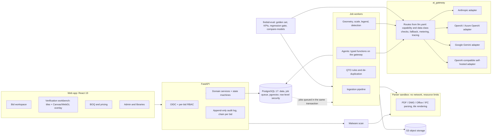
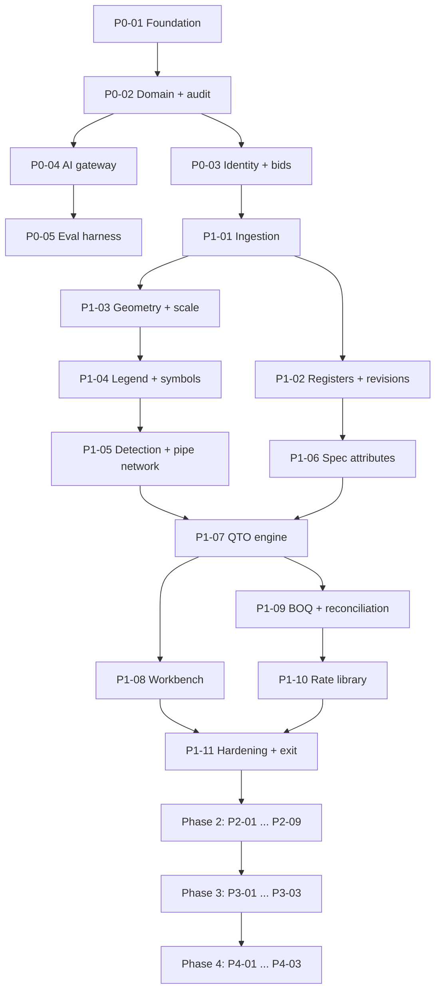

# FireBid SG: Implementation Plan

| Item | Detail |
|---|---|
| Baseline | Requirements Specification v2.2 (`FireBid_SG_Agentic_AI_Requirements_v2.docx`, Markdown copy in `docs/requirements/`) |
| Date | 22 September 2026 |
| Status | Draft. Assumes sponsor decisions D1–D5 as recommended in requirements §17. |
| Companion files | `project-context.md` (binding conventions), `prompts/` (one build prompt per step), `BUILD_LOG.md` (created by step P0-01) |

## 1. How this plan works

The build is split into **31 steps** across five phases. Each step:

- delivers a working, tested increment that a person can demo;
- names the requirement IDs it covers, so progress can be checked with `make req-coverage`;
- has a build prompt in `docs/plan/prompts/<step-id>-*.md`, ready to paste into a fresh Claude Code session (or another coding agent).

Step phases follow **build order**. Requirement phases (P1–P4 in the spec) follow **release scope**. The two mostly match; where a step builds foundations early (e.g. the bid workspace in P0-03), the requirement is still released and accepted with its spec phase.

Phase 2–4 prompts are written against today's knowledge. At each phase exit, re-plan the next phase and update its prompts with what was learned (§8).

## 2. Delivery approach

**Tracks.** Two tracks run in parallel. The build track (§4–§5) delivers software through the step prompts. The business readiness track (§6) delivers decisions, data, licences, pilots and training. Several build steps cannot finish without business-track outputs, and those dependencies are marked "Needs".

**Cadence.** Two-week sprints; a demo every sprint; phase-gate reviews against the exit criteria in requirements §13.2.

**Indicative team.** Product Owner (Estimating Manager or a delegate), Project Manager, Tech Lead / Architect, 2 backend engineers, 1 geometry / computer-vision engineer, 1 frontend engineer, 1 QA / test-automation engineer, part-time DevOps. Part-time SMEs: estimators (golden set labelling, UAT) and Design Manager (Phase 2–3 specification and compliance review). Engineers use AI coding agents with the step prompts; people own review, merge and acceptance.

**One session per step.** Each step prompt starts in a fresh agent session. The agent reads `project-context.md`, the requirement sections named in the prompt, and `BUILD_LOG.md` for what already exists. This keeps each session focused on the current step. Large steps may span several sessions: the agent records progress in the build log, and the next session resumes from it.

**Sizing.** Relative sizes for the indicative team with AI assistance: **S** ≤ 1 week, **M** 1–2 weeks, **L** 2–4 weeks, **XL** 4–6 weeks. Re-estimate at the end of Phase 0.

## 3. Target architecture

**Fewer moving parts.** PostgreSQL holds the data, the job queue, vector search and shared counters, and there is no Redis or separate broker. Agents are plain functions run as jobs, and the Phase 4 orchestration engine is decided at the Phase 3 exit (ADR-007, ADR-009). Files from outside are malware-scanned and opened only in the sandbox.

**LLM providers are configurable.** Callers name a route. `backend/config/llm.yaml` maps each route to a primary model and ordered fallbacks across providers. A provider receives a call only when it is approved for that route's data class, and a route's models change only on `compare-models` evidence plus product owner approval (details in `project-context.md`).

Conventions, stack and guardrails: `project-context.md`.

## 4. Step catalogue

| Step | Name | Requirements | Depends on | Size | Prompt |
|---|---|---|---|---|---|
| **P0-01** | Repository foundation, Dev Container, job queue and ADRs | Enablers; traceability tooling | – | M | [P0-01](prompts/P0-01-repository-foundation.md) |
| **P0-02** | Domain model, state machines and audit log | FR-DOC-07, FR-ADM-04 (API), NFR-07, NFR-09 | P0-01 | M | [P0-02](prompts/P0-02-domain-model-and-audit.md) |
| **P0-03** | Identity, RBAC and bid workspace | FR-BID-01, 02, 03; FR-ADM-01, 04 (UI); NFR-06, NFR-08 | P0-02 | M | [P0-03](prompts/P0-03-identity-rbac-bid-workspace.md) |
| **P0-04** | Multi-provider AI gateway and agent runtime | FR-ADM-05; NFR-05, 11, 14, 15; agent contract (§8.4) | P0-02 | L | [P0-04](prompts/P0-04-ai-gateway-agent-runtime.md) |
| **P0-05** | Evaluation harness, golden set tooling and model comparison | FR-LRN-01; NFR-11; KPI definitions (§14) | P0-02, P0-04 | M | [P0-05](prompts/P0-05-evaluation-harness.md) |
| **P1-01** | Document ingestion, malware scan and parser sandbox | FR-DOC-01 (P1 formats), FR-DOC-07; NFR-01 (ingest) | P0-03 | L | [P1-01](prompts/P1-01-document-ingestion.md) |
| **P1-02** | Classification, registers and revision control | FR-DOC-02, 03, 04, 05, 06 | P1-01, P0-04, P0-05 | L | [P1-02](prompts/P1-02-classification-registers-revisions.md) |
| **P1-03** | Sheet geometry, text and scale | FR-VIS-01, 05, 06 (text), 07, 08 | P1-01 | L | [P1-03](prompts/P1-03-sheet-geometry-and-scale.md) |
| **P1-04** | Legend and symbol mapping | FR-VIS-02; FR-ADM-02 (object and symbol libraries) | P1-03, P0-04 | L | [P1-04](prompts/P1-04-legend-and-symbol-mapping.md) |
| **P1-05** | Fire protection object detection and pipe network | FR-VIS-03, 06 (association), 09 | P1-04, P0-05 | XL | [P1-05](prompts/P1-05-object-detection-pipe-network.md) |
| **P1-06** | Specification attribute extraction | FR-SPEC-01, 05 | P1-02, P0-04 | M | [P1-06](prompts/P1-06-spec-attribute-extraction.md) |
| **P1-07** | QTO engine, rules and de-duplication | FR-QTO-01–05, 08, 09, 10, 11 (API); FR-ADM-02 (rules) | P1-05, P1-06 | XL | [P1-07](prompts/P1-07-qto-engine.md) |
| **P1-08** | Verification workbench | FR-REV-01, 02, 03, 04, 06; FR-QTO-11 (UI); NFR-10, NFR-12 | P1-07 (viewer shell can start after P1-03) | XL | [P1-08](prompts/P1-08-verification-workbench.md) |
| **P1-09** | BOQ generation and client BOQ reconciliation | FR-BOQ-01–06; FR-ADM-03; NFR-13 (xlsx) | P1-07 | L | [P1-09](prompts/P1-09-boq-and-reconciliation.md) |
| **P1-10** | Rate library pricing | FR-CST-01 | P1-09 | S | [P1-10](prompts/P1-10-rate-library-pricing.md) |
| **P1-11** | Phase 1 hardening, pilot support and exit evaluation | NFR-01–07, 09, 14, 15; P1 exit criteria | All P1 | L | [P1-11](prompts/P1-11-phase1-hardening-and-exit.md) |
| **P2-01** | Extended fire protection systems and supports | FR-VIS-04; FR-QTO-06, 07 | P1-11 | L | [P2-01](prompts/P2-01-extended-systems-and-supports.md) |
| **P2-02** | Revision deltas, multi-bid projects and sampling | FR-DOC-08; FR-QTO-12; FR-BID-04; FR-REV-05 | P1-11 | L | [P2-02](prompts/P2-02-revision-deltas-multibid-sampling.md) |
| **P2-03** | Full specification analysis and scope matrix | FR-SPEC-02, 03, 04 | P1-11 | L | [P2-03](prompts/P2-03-full-spec-analysis.md) |
| **P2-04** | Supplier quotations and cost build-up | FR-CST-02–09 | P1-10 | L | [P2-04](prompts/P2-04-supplier-quotes-cost-buildup.md) |
| **P2-05** | Labour estimation | FR-LAB-01, 02, 03 | P2-04 | M | [P2-05](prompts/P2-05-labour-estimation.md) |
| **P2-06** | Tender clarifications register | FR-RFI-01, 02, 04, 05, 06, 07 | P2-03 | L | [P2-06](prompts/P2-06-tender-clarifications.md) |
| **P2-07** | Bid risk and qualifications | FR-RSK-01–06 | P2-03, P2-06 | L | [P2-07](prompts/P2-07-bid-risk-and-qualifications.md) |
| **P2-08** | Review pack, gates G2–G4, submission freeze, outcomes | FR-PKG-01, 02, 03; FR-LRN-02, 03 | P2-04, P2-05, P2-07 | M | [P2-08](prompts/P2-08-review-pack-gates-freeze.md) |
| **P2-09** | Phase 2 hardening and exit evaluation | P2 exit criteria; NFR regression | All P2 | M | [P2-09](prompts/P2-09-phase2-hardening-and-exit.md) |
| **P3-01** | Compliance knowledge corpus and cited retrieval | FR-CMP-01–05 | P2-09 | L | [P3-01](prompts/P3-01-compliance-knowledge.md) |
| **P3-02** | BIM ingestion and multi-discipline coordination | FR-DOC-01 (BIM formats); FR-CRD-01–05; FR-RFI-03; NFR-13 (IFC) | P2-09 | XL | [P3-02](prompts/P3-02-bim-coordination.md) |
| **P3-03** | Manpower view, Phase 4 orchestration decision, Phase 3 hardening and exit evaluation | FR-LAB-04; P3 exit criteria | P3-01, P3-02 | M | [P3-03](prompts/P3-03-phase3-hardening-and-exit.md) |
| **P4-01** | End-to-end orchestration and bid/no-bid | FR-BID-05, 06 | P3-03 | L | [P4-01](prompts/P4-01-orchestration-and-bid-no-bid.md) |
| **P4-02** | Contract terms review and full tender package | FR-RSK-07; FR-PKG-04 | P4-01 | L | [P4-02](prompts/P4-02-contract-terms-and-package.md) |
| **P4-03** | Learning from actuals, IFC-SG alignment, Phase 4 exit | FR-LRN-04; FR-LAB-05; FR-CRD-06; P4 exit criteria | P4-01 | L | [P4-03](prompts/P4-03-learning-and-phase4-exit.md) |

Every FR and NFR ID in the requirements is assigned to at least one step (checked when this plan was written).

## 5. Sequencing and critical path

**Critical path (Phase 1):** P1-01 → P1-03 → P1-04 → P1-05 → P1-07 → P1-08 → P1-11. Drawing intelligence carries the most technical risk, so the geometry / CV engineer starts P1-03 as soon as ingestion produces sheets.

**Parallel streams in Phase 1:**

| Stream | Steps | Owner profile |
|---|---|---|
| A: Documents and specifications | P1-01 → P1-02 → P1-06 | Backend |
| B: Drawing intelligence | P1-03 → P1-04 → P1-05 → P1-07 | Geometry / CV + backend |
| C: Workbench | Viewer shell (after P1-03) → P1-08 | Frontend |
| D: Commercial | P1-09 → P1-10 | Backend |

**Phase 2 order:** P2-01, P2-02, P2-03 and P2-04 can start together once Phase 1 exits. P2-05 follows P2-04; P2-06 follows P2-03; P2-07 follows P2-06; P2-08 closes the commercial flow; P2-09 is the exit step.

## 6. Business readiness track (no build prompts)

| When | Activity | Owner | Unblocks |
|---|---|---|---|
| P0 wk 1–2 | Decisions D1–D5 (MVP scope, hosting and each LLM provider's data terms and approved data classes, golden set owner, ERP, gate approvers) | Sponsor | ADR-004, P0-03 roles, P0-05 data |
| P0 wk 1–4 | Licence decisions: DWG converter (ODA), CAD/BIM SDKs (DP3) | Tech Lead + Procurement | ADR-003, P1-01 |
| P1, after P1-03 benchmark | PyMuPDF commercial licence: buy only if the ADR-002 benchmark shows a material speed or completeness gain over PDFium | Product Owner + Procurement | P1-03 engine choice |
| P0 wk 1–4 | Legal review: data use under tender confidentiality terms (Q8); data processing terms for each LLM provider to be enabled (region, retention, no-training), producing the approved data classes per provider; Singapore Standards licence for AI use (DP4) | Legal | ADR-004, P0-04 config, P3-01 |
| P0 wk 2–4 | Commercial accounts and credentials for each approved LLM provider, with spend limits | IT / Procurement | P0-04 live tests |
| P0 wk 2–8 | Golden set: 10–20 historical tenders with verified takeoffs, captured in the P0-05 template; include scanned and vector sets from several consultants | Estimating Manager + estimators | P0-05, P1-02 onward |
| P0 wk 2–6 | Baseline time-and-motion study on 3–5 tenders (QTO hours, turnaround, rework) | Project Manager | KPI baselines (§14) |
| P0 wk 3–6 | Cloud account in a Singapore region, IdP app registration, security review of ADR-004 | IT / Security | P0-03, P1-11 |
| P1 mid | Select 3 live tenders for shadow mode; nominate estimator champions | Bid Manager | P1-11 pilot |
| P1 end | Estimator training (≤ 1 day), UAT sign-off, Phase 1 gate review | PM + Product Owner | Phase 2 start |
| P2 start | Supplier quote samples, company rate tables (wages, levy, accommodation, transport, insurance), productivity data, clarification templates, risk-appetite thresholds | Procurement, Finance, Estimating | P2-04, P2-05, P2-06, P2-07 |
| P3 start | Licensed code corpus and a named knowledge owner; sample IFC models from consultants | Design Manager | P3-01, P3-02 |
| P4 start | Post-award actuals feed from project delivery; contract templates in use | Operations, Commercial | P4-02, P4-03 |

## 7. Phase gates

| Phase | Exit criteria (requirements §13.2, proposed) | Evidence produced by |
|---|---|---|
| P0 | Baseline signed off; golden set ready; ADR-001 to ADR-007 accepted; foundation steps demoed | P0-05 report, ADRs, BUILD_LOG |
| P1 | Sprinkler count ≥ 98% and pipe length within ±5% on the golden set; ≥ 30% QTO effort reduction in shadow pilot on ≥ 3 live tenders; all P1-scope requirement IDs covered by tests | P1-11 exit report |
| P2 | Estimate turnaround −30%; zero unsourced prices; ≥ 70% of clarifications issued with only minor edits | P2-09 exit report |
| P3 | Coordination precision ≥ 70%; citation accuracy ≥ 98% | P3-03 exit report |
| P4 | Bid cycle time −40%; missed-scope incidents down against baseline | P4-03 exit report |

A gate review checks the exit report, `make req-coverage` for the phase's requirement IDs, open risks (requirements §16) and the business-track items for the next phase.

## 8. Running a step

1. **Pre-flight.** The previous step is merged and has a build log entry. Business-track items listed under "Needs" in the prompt are available, or the prompt's fallback applies.
2. **Start fresh.** Open the repository in its Dev Container, then start a new Claude Code session at the repository root. (Before P0-01 creates the container, the host shell is used.)
3. **Hand over the prompt.** Paste the prompt file, or say: `Execute docs/plan/prompts/<step-file>.md`.
4. **Approve the plan.** The agent replies with a plan mapped to the prompt's "Done when" list. Check it against the requirement IDs before approving.
5. **Build.** For L and XL steps, ask for one commit per coherent sub-part so review stays manageable.
6. **Review.** Run `/code-review` against the step's starting commit, check `make req-coverage`, and demo UI steps to the Product Owner.
7. **Close.** Merge, confirm the build log entry, and update this plan's status if scope or order changed.

**Re-planning.** At each phase gate, update §4–§6 and the next phase's prompts with what the build log, exit report and pilot feedback show.
