# FireBid SG User Manual

FireBid SG takes a fire-protection tender from uploaded documents to a priced, reviewed bid.
The manual has four parts:

| Part | Read it to |
| --- | --- |
| [A tender from upload to award](happy-path.md) | Follow one bid through every step, with who does what |
| [Steps some tenders need](other-steps.md) | Handle an addendum, a tender kept in folders, a supplier's quotation, or drawings that show design intent only |
| [When something is not right](exceptions.md) | Find out what a warning or a blocked step means, and what to do |
| This page | Look up what a screen offers |

This page walks through each screen in the order a bid uses them. The screenshots were
taken on 2026-10-08 and 2026-10-10 from synthetic test bids. See also
[the estimator quick start](../user/estimator-quick-start.md).

For a Word copy of all four parts, run
`uv run --project backend python scripts/generate_user_manual_docx.py`; it writes
`FireBid_SG_User_Manual.docx` beside this page.

## Contents

1. [Signing in](#1-signing-in)
2. [Your bids and registering a new bid](#2-your-bids-and-registering-a-new-bid)
3. [The bid page](#3-the-bid-page)
4. [Tender documents](#4-tender-documents)
5. [Registers](#5-registers)
6. [Symbols](#6-symbols)
7. [Specification and design development](#7-specification-and-design-development)
8. [Workbench](#8-workbench)
9. [BOQ, rates and pricing](#9-boq-rates-and-pricing)
10. [Clarifications, risk and review](#10-clarifications-risk-and-review)
11. [Library, KPIs and History](#11-library-kpis-and-history)

## 1. Signing in

You sign in with your organisation's single sign-on; FireBid SG never holds your password.

1. Open FireBid SG in your browser and press **Sign in**.
2. Enter your work account details on your identity provider's page.
3. You are returned to **Your bids**.

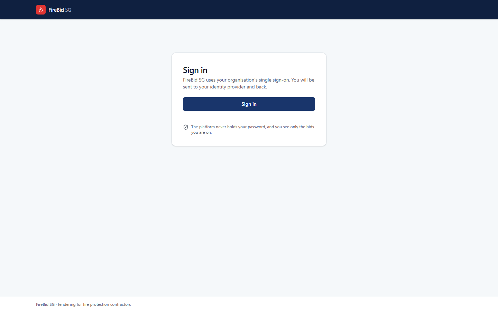

You see only the bids you are a member of. What you can do on a bid depends on your role:

| Role | What it does in FireBid SG |
| --- | --- |
| Bid manager | Registers bids and sets their deadlines |
| Estimator | Uploads documents, confirms symbols, reviews the takeoff |
| Senior estimator | Approves gates G1 and G2, and approves changes to the rate library |
| Commercial director | Approves gates G3 and G4 |

The top bar is the same on every screen: **Bids**, **Library**, **Rates**, **KPIs** and
**History**, with your name and **Sign out** on the right.

## 2. Your bids and registering a new bid

**Your bids** lists every bid you are on, nearest deadline first. The four tiles at the top
count active bids, bids due within 7 days, tasks to do and tasks past due.

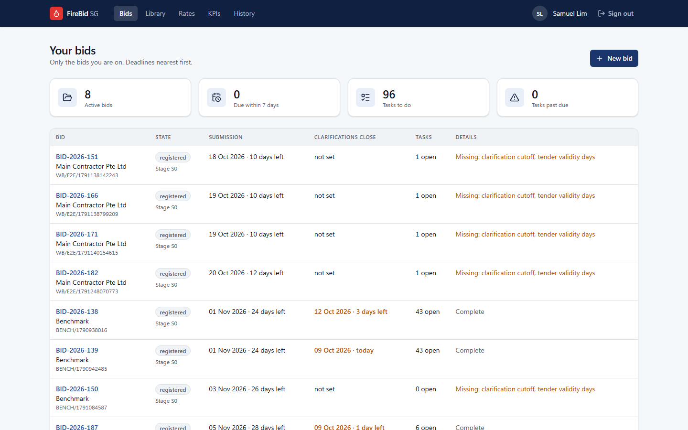

Each row shows the bid number, client and tender reference, its state and stage, the
submission deadline with days left, when clarifications close, open tasks, and any details
still missing. Click a bid number to open it.

To register a bid, press **New bid** and fill in the form:

1. **Project**, **Client** and **Tender reference**.
2. **Design consultant**: whose drawings these are. Symbols confirmed on one of their
   tenders are reused on the next.
3. **Submission deadline**.
4. **Clarifications close** and **Tender validity (days)** are optional now, but
   qualification stays blocked until both are in.
5. Press **Register bid**. The new bid opens with its number, such as BID-2026-182.

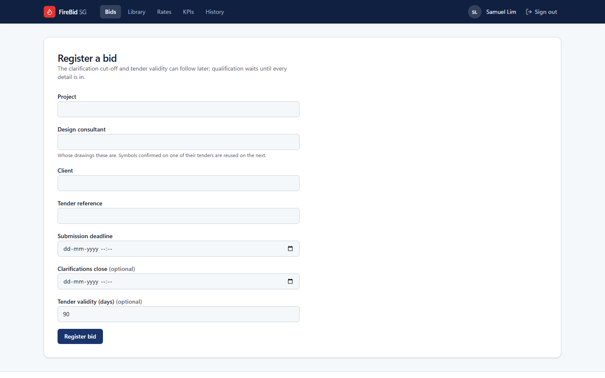

## 3. The bid page

The bid page shows the bid's stage and dates at the top and ten numbered cards below, one
per step, in the order you work through them.

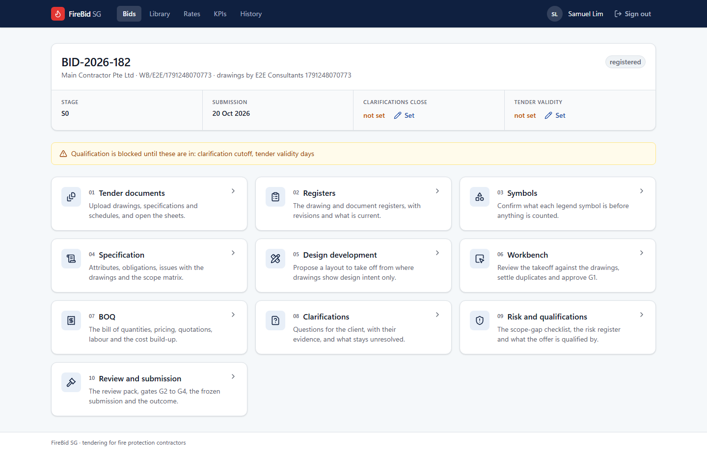

- **Stage, Submission, Clarifications close, Tender validity** sit across the top. Press
  **Set** beside a date that is not set to fill it in.
- A yellow banner says what is still blocking the bid, for example missing dates.
- Each card opens a step. Once inside a step, the tab bar under the top bar moves between
  steps, and **Back to the bid** returns here.
- **Move the bid on**, below the cards, offers the moves open from the bid's state: start
  qualification, the decision to bid (G0), submit for review, send back for rework,
  withdraw. Each belongs to a role, and one that is not yours says whose it is.
- **Team** lists who is on the bid and in what role. A bid manager adds people there,
  changes a role, or takes someone off the bid.

| Step | What you do there |
| --- | --- |
| 01 Tender documents | Upload drawings, specifications and schedules; open the sheets |
| 02 Registers | Check every drawing and document has one current revision |
| 03 Symbols | Confirm what each legend symbol is, before anything is counted |
| 04 Specification | Review obligations, issues against the drawings and the scope matrix |
| 05 Design development | Propose a layout where drawings show design intent only |
| 06 Workbench | Review the takeoff against the drawings and approve G1 |
| 07 BOQ | Build the bill of quantities, price it, add labour and costs |
| 08 Clarifications | Draft questions for the client and track what stays unresolved |
| 09 Risk and qualifications | Scope-gap checklist, risk register, what the offer is qualified by |
| 10 Review and submission | Review pack, gates G2 to G4, the submission and its outcome |

## 4. Tender documents

Upload the whole tender set here; FireBid SG splits it into sheets and reads each one.

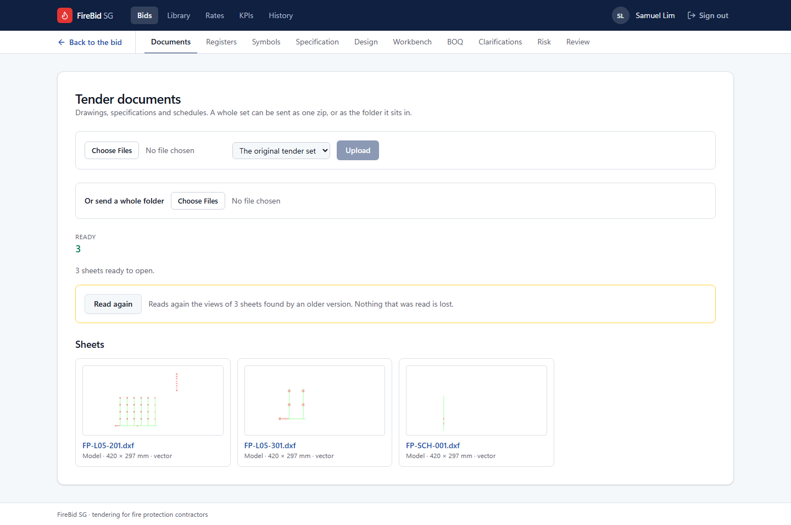

1. Press **Choose Files** and pick drawings, specifications and schedules. A whole set can
   be sent as one zip.
2. Choose what the upload is from the dropdown (the original tender set is the default),
   then press **Upload**.
3. To send a folder as it sits on disk, use **Or send a whole folder**.
4. Watch the counter: sheets move to **Ready** as they finish. Each ready sheet appears
   under **Sheets** with a thumbnail, its size and whether it is vector.
5. Click a sheet to open it.

If a yellow **Read again** box appears, some sheets were read by an older version of the
platform. Press **Read again** to refresh them; nothing already read is lost.

An opened sheet shows how accurate takeoff from it is expected to be (for example, high for
a vector sheet with a stated scale) and a viewer you can zoom and pan.

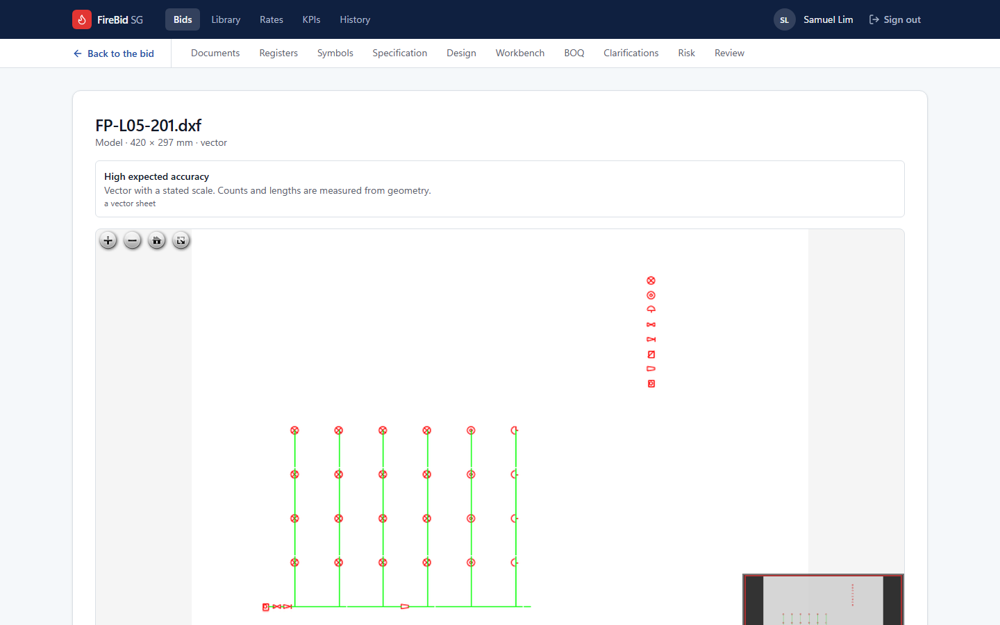

## 5. Registers

The registers list every drawing and document in the tender set, with the one revision of
each that is current.

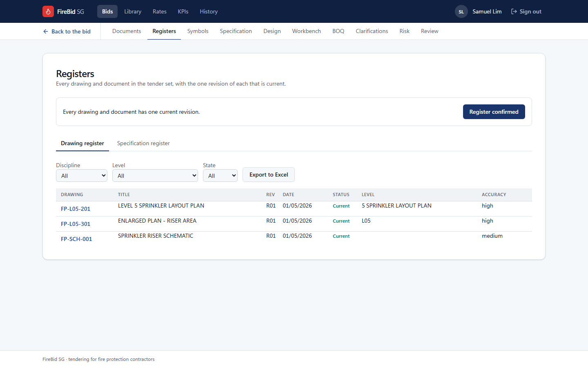

- **Drawing register** and **Specification register** are the two tabs.
- Each drawing shows its number, title, revision, date, status, level and expected
  accuracy. These are read from the title block.
- Filter by **Discipline**, **Level** or **State**, and press **Export to Excel** to take
  the register out.
- Click a drawing number to open the sheet.
- When every drawing and document has one current revision, confirm the register with the
  button at the top right. It then reads **Register confirmed**.

When an addendum brings a newer revision of a drawing, the newer one becomes current and the
older one is kept as superseded.

## 6. Symbols

Nothing is counted until a person confirms what each legend symbol is.

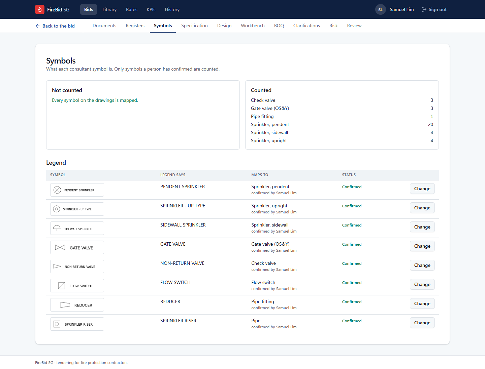

The **Legend** table has one row per symbol found in the drawings' legends:

- **Symbol**: the legend row as drawn.
- **Legend says**: the consultant's description.
- **Maps to**: the object type FireBid SG proposes, or the one a person confirmed and who
  confirmed it.
- **Status**: Proposed until someone confirms it, then Confirmed.

To work through the legend:

1. Check each proposed row against the symbol and its description.
2. Confirm it if the proposal is right, or press **Change** and pick the correct object
   type.
3. Watch the two boxes at the top. **Counted** totals each confirmed type across the
   drawings. **Not counted** lists symbols on the drawings that no confirmed row explains;
   it should read "Every symbol on the drawings is mapped" before you move on.

A confirmation is remembered for that design consultant, so their next tender needs no
second pass.

## 7. Specification and design development

**Specification** shows what the specification says that takeoff needs, each item with the
clause it comes from. Takeoff uses only what a person has confirmed.

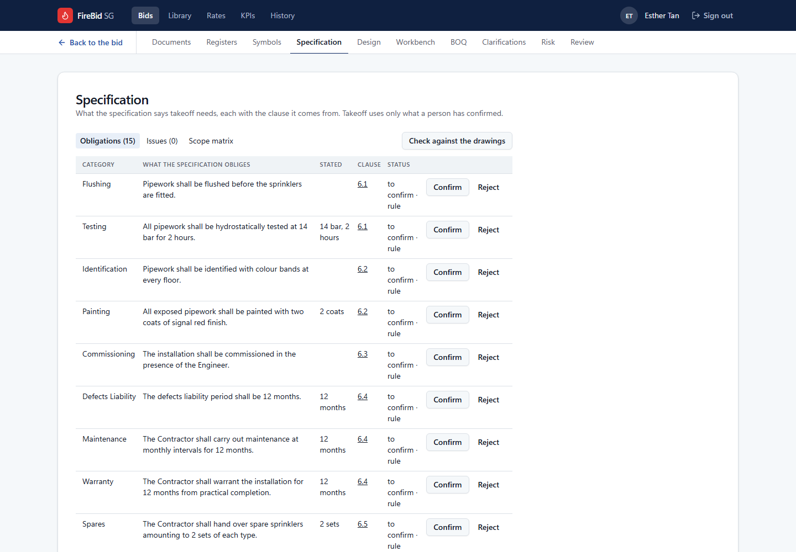

- **Obligations**: requirements read from the specification, for you to confirm.
- **Issues**: where the specification and the drawings disagree. Press **Check against the
  drawings** to find them.
- **Scope matrix**: what is in and out of scope.

The page stays empty until a specification has been uploaded on the documents page and
read. The walkthrough shows the [issues and the scope matrix](happy-path.md#6-read-the-specification-estimator).

**Design development** is for sheets drawn as design intent only, where heads and range
pipes are the contractor's to develop.

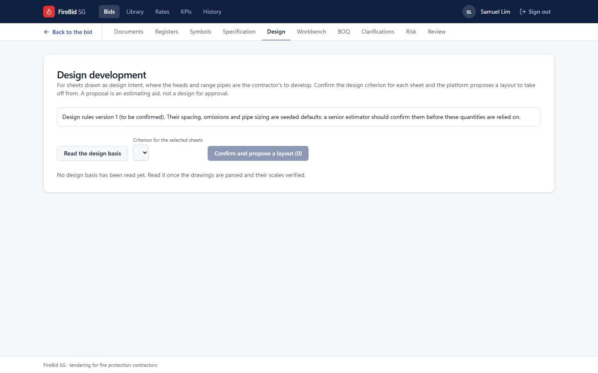

1. Press **Read the design basis** once the drawings are parsed and their scales verified.
2. Pick the **Criterion for the selected sheets**.
3. Press **Confirm and propose a layout**.

A proposed layout is an estimating aid to take off from, not a design for approval. The
design rules it uses are seeded defaults until a senior estimator confirms them.

## 8. Workbench

The workbench is where you check the takeoff against the drawing, item by item, and approve
gate G1.

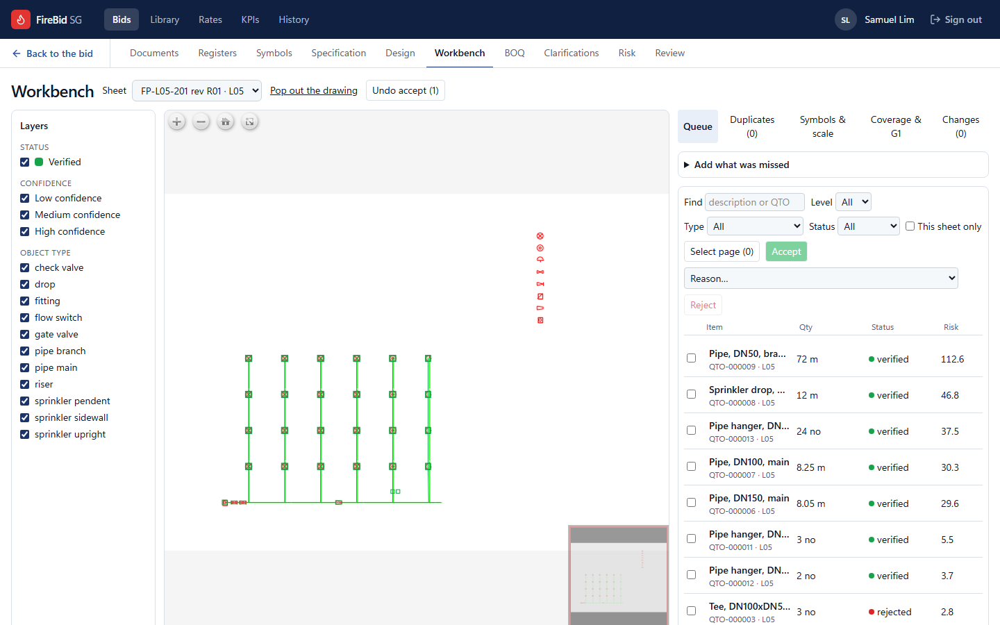

The screen has three parts:

- **Layers** (left): show or hide marks on the drawing by status, confidence and object
  type.
- **The drawing** (middle): every taken-off item is marked where it was found. Pick the
  sheet from the **Sheet** dropdown. **Pop out the drawing** opens it alone in a second
  window, for a second monitor.
- **The panel** (right), with five tabs: **Queue**, **Duplicates**, **Symbols & scale**,
  **Coverage & G1** and **Changes**.

To review the queue:

1. Narrow the list with **Find**, **Level**, **Type**, **Status** or **This sheet only**.
   Items are listed with quantity, status and a risk score, highest risk first.
2. Click an item to see it on the drawing.
3. Tick the items that are right and press **Accept**. **Select page** ticks the whole
   page.
4. For an item that is wrong, choose a **Reason** and press **Reject**.
5. **Undo accept** reverses your last acceptance.
6. Open **Add what was missed** to add an item the takeoff did not find.

Then clear the other tabs:

- **Duplicates**: settle items counted on more than one sheet.
- **Symbols & scale**: check the symbols and scale the sheet was read with.
- **Changes**: what changed since an earlier revision.
- **Coverage & G1**: how much of the takeoff is verified. When coverage meets the policy
  and no duplicates are open, the senior estimator approves G1 here.

## 9. BOQ, rates and pricing

The BOQ page builds our bill of quantities from the verified takeoff, maps the client's
bill to it and reconciles the two.

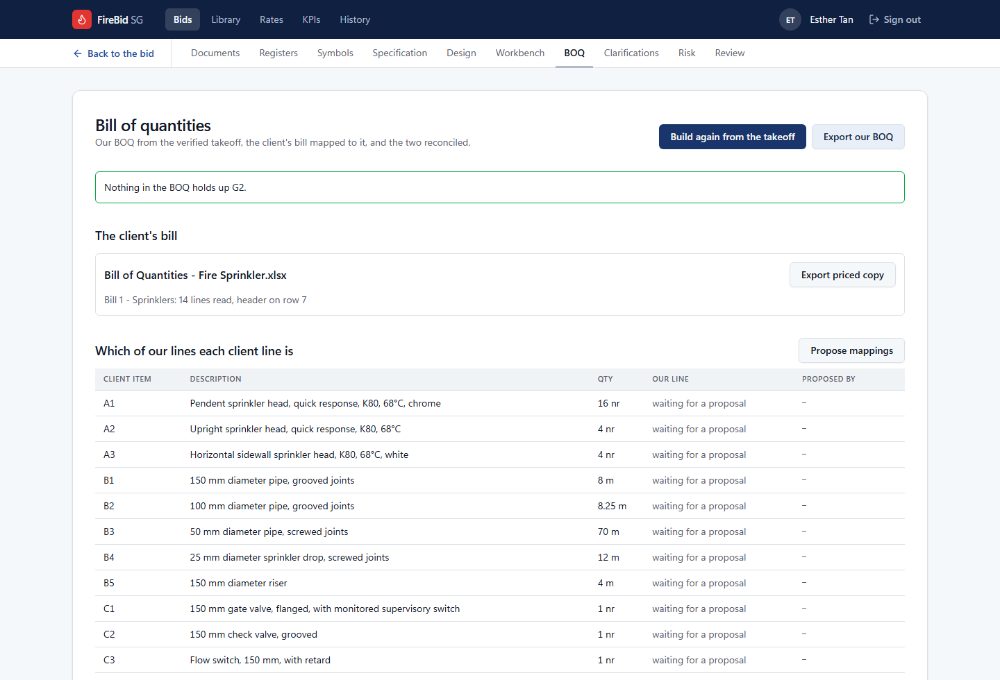

1. Set the **Measurement conventions**: how pipe is measured, fittings, hangers and
   supports, and sprinkler drops. The wording you choose is printed below as it will appear
   with the bill.
2. Press **Build the BOQ**.
3. If the client issued their own BOQ workbook, upload it on the documents page. It is read
   once it is registered as a BOQ, and then compared with ours.
4. Price the lines, then add quotations, labour and the cost build-up.

A banner at the top tells you what is holding up gate G2, for example that no BOQ is built
yet; once nothing does, it reads "Nothing in the BOQ holds up G2". The walkthrough shows
[mapping, reconciliation, pricing, labour and the cost build-up](happy-path.md#8-build-map-and-price-the-boq-estimator).

BOQ lines are priced only from the **Rate library**, opened from **Rates** in the top bar.

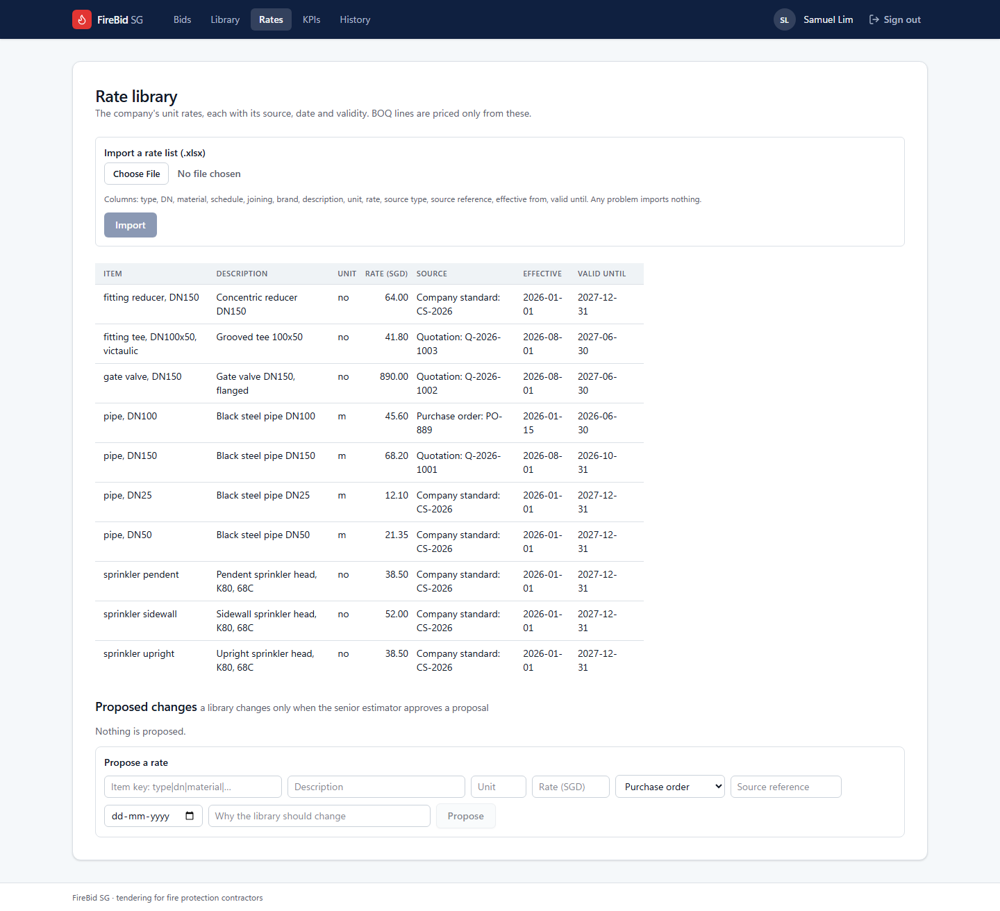

- Every rate carries its source (company standard, quotation or purchase order), the date
  it is effective from and the date it is valid until.
- **Import a rate list (.xlsx)** loads many rates at once. Any problem in the file imports
  nothing.
- **Propose a rate** suggests a single change with its source and the reason. The library
  changes only when the senior estimator approves the proposal.

The same page holds the **Productivity library**: man-hours for a unit of each item, each
with its source. Labour is worked out only from these. The senior estimator imports the
company's list with **Import the productivity list**; any problem in the file imports
nothing. **Enter one figure by hand** takes a single figure with its source.

Below it, **Exchange rates** lists what a quotation in another currency is brought to
SGD at. The senior estimator records a rate with its source and date; a quotation in a
currency with no rate cannot be confirmed.

## 10. Clarifications, risk and review

**Tender clarifications** holds the questions for the client before the clarification
cut-off.

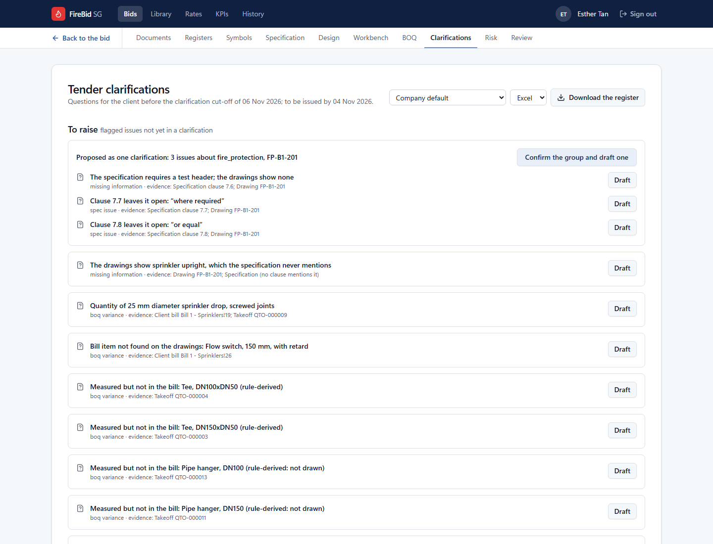

- **To raise** lists flagged issues that are not yet in a clarification.
- **Register** lists every clarification drafted. Choose a template and a format, then
  press **Download the register** to send it.
- **Qualifications** proposes a qualification for each clarification still unresolved at
  submission. Press **Prepare the submission** to generate them.

**Risk and qualifications** records scope gaps, design responsibility and execution risk,
each with its evidence.

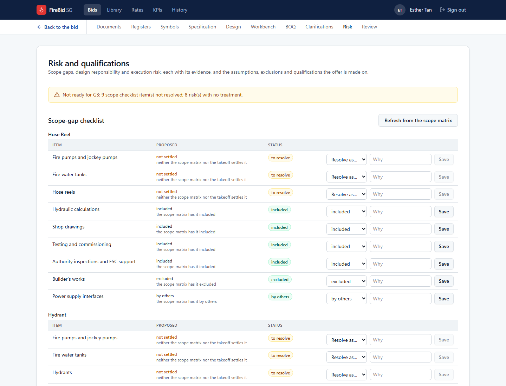

1. Press **Build the checklist** to pre-fill the scope-gap checklist from the scope matrix
   and the takeoff.
2. Press **Find the risks** to read risks from the specification, the drawings and the
   bid's parameters.
3. Press **Propose from risks and scope** to draft assumptions, exclusions and
   qualifications, each linked to the item it comes from.

A yellow banner says what is still missing for gate G3.

**Review and submission** shows the estimate as an approver sees it.

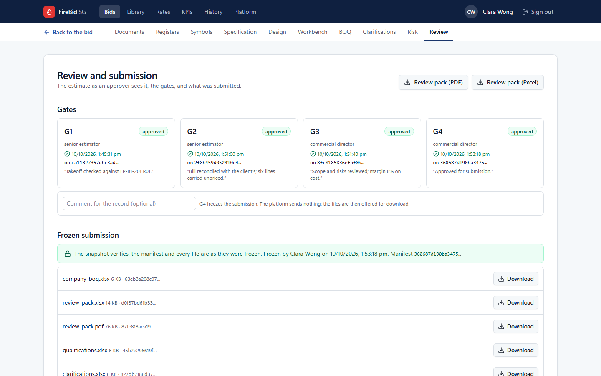

The four gates are approved in order, and each card lists what blocks it. G1 is approved in the workbench; G2, G3 and G4 here, each by its own role:

| Gate | Approved by | Needs |
| --- | --- | --- |
| G1 | Senior estimator | The takeoff verified in the workbench |
| G2 | Senior estimator | A built BOQ |
| G3 | Commercial director | G2 approved, the scope-gap checklist built, the bid under review |
| G4 | Commercial director | G3 approved, no clarification unresolved, every qualification accepted or rejected |

Approving G4 freezes the submission: the page then lists the frozen files for download
(the client's own bill, priced, among them where they issued one), and
the bid manager records the outcome under them.

Below the gates, the **Review pack** gives the totals with and without GST, margin, risk
allowances and unpriced lines, then the estimate by component and by system, cost drivers,
quantity variances against the client's bill, open clarifications and G1 coverage. Download
it with **Review pack (PDF)** or **Review pack (Excel)**.

## 11. Library, KPIs and History

**Library** lists the object types FireBid SG can take off and how each consultant draws
them.

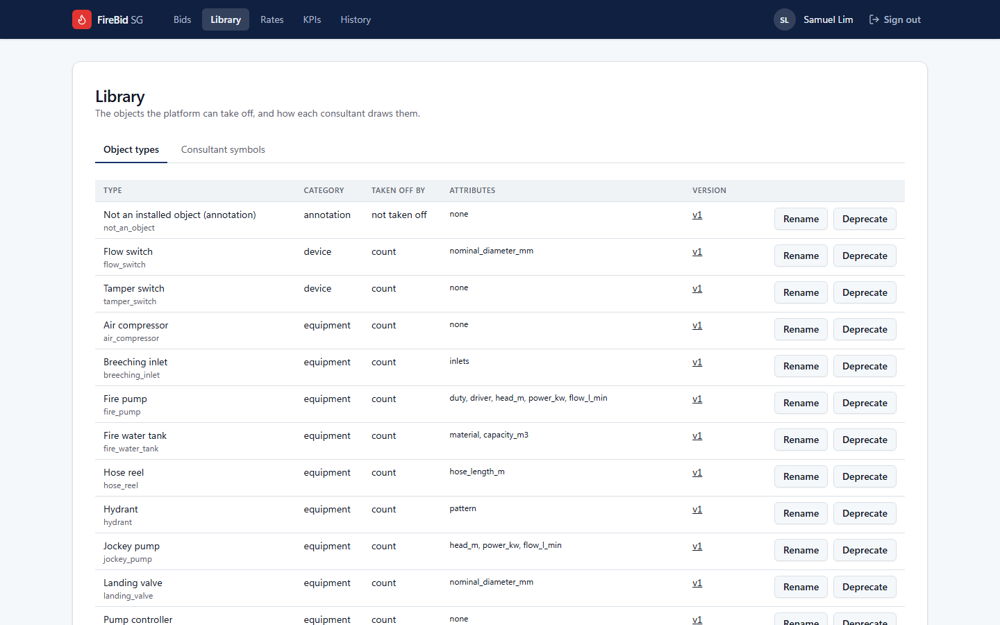

- **Object types**: each type's category, whether it is taken off by count or by length,
  its attributes and its version. **Rename** changes a label; **Deprecate** retires a type
  so it can no longer be chosen.
- **Consultant symbols**: the confirmed symbol mappings, by consultant.

**KPIs** shows what each bid measures: AI items, false detections, items missed and added
by hand, open duplicates, time on task and AI cost. The Phase 2 table adds tender
turnaround, price provenance and clarification acceptance.

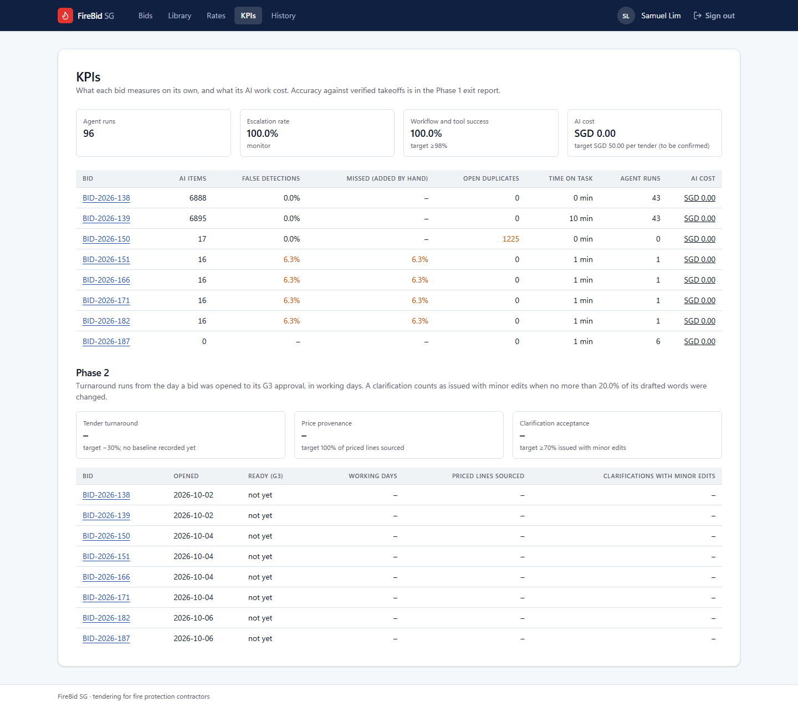

**History** is the record of every action, newest first: when, who, what, on which item and
why. It cannot be edited or deleted. Filter by action, entity or date range, and press
**Export CSV** to take it out.

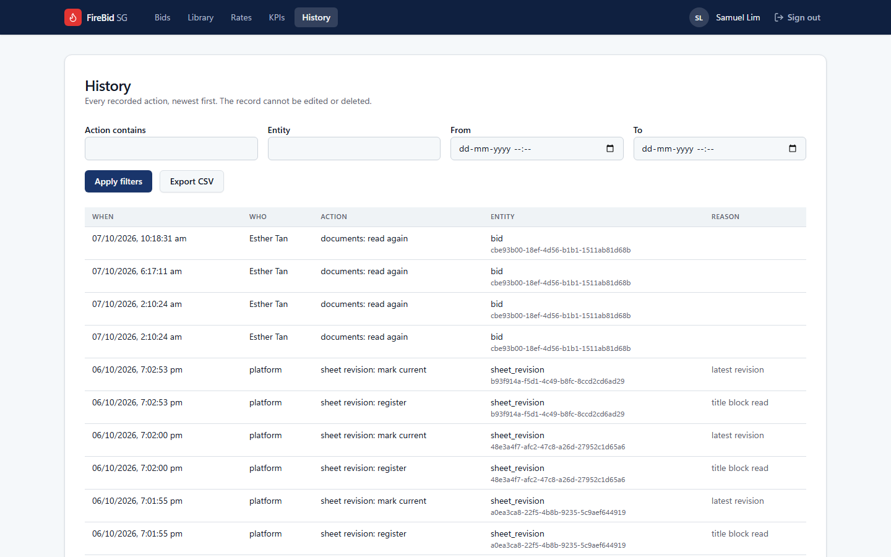

The **Platform** page (model routing and AI spend) is for administrators only and is not
covered here.
