# When something is not right

FireBid SG does not fail silently. When a step cannot go ahead it says so on the screen,
says why, and in most cases links to where the matter is settled. This guide lists what
you may meet, what it means and what to do.

For the same bid with nothing in the way, see
[a tender from upload to award](happy-path.md).

The screenshots were taken on 2026-10-10 from two synthetic bids on the local stack.

## At a glance

| What you see | Where | What it means | What to do |
| --- | --- | --- | --- |
| **Bid not found** | Opening a bid | You are not on the bid's team, or it does not exist | Ask the bid manager to have you added |
| "You are not on any bids yet" | Your bids | You are on no bid's team | The same, or register a bid |
| "Please fill out this field" | Register a bid | A required field is empty | Fill it in and press **Register bid** again |
| "Qualification is blocked until these are in" | The bid page | A date is missing | Press **Set** beside it |
| **Refused** | Tender documents | The file is of a type that cannot be read | Send it in a readable format, or leave it out |
| **To confirm** | Symbols | Nobody has confirmed the legend row | Confirm, correct or reject it |
| **Not counted** lists symbols | Symbols | Symbols on the drawings that no confirmed row explains | Confirm the row, or name the symbol |
| **Duplicates (n)** | Workbench | Items drawn on more than one sheet | Decide which sheet they are counted from |
| "G1 is blocked by" | Workbench, Coverage & G1 | Something is undecided in the takeoff | Follow the link in each line |
| "Only a Senior Estimator approves G1" | Workbench | The approval is not yours | Ask the senior estimator |
| "G2 is held up: no BOQ is built" | BOQ | There is no bill yet | Press **Build the BOQ** |
| **unpriced** | BOQ, Pricing | The rate library has no rate for the line | Choose a rate, or propose one |
| "the rate expired on …" | BOQ, Pricing | The rate's validity has run out | Get a current rate into the library |
| "Nothing was imported" | Rates | The rate list has a bad row | Fix the rows named and import again |
| "Not ready for G3" | Risk | Checklist items or risks are undecided | Resolve and treat each one |
| A gate reads **blocked** | Review | Something it needs is missing | Clear each reason listed on its card |

## Getting in

### A bid is not found

You see only the bids you are on. If you open the address of a bid you are not on, the
page says **Bid not found: it may not exist, or you may not be on its team.** It says the
same for a bid that does not exist, so that nobody learns of a bid they are not on.

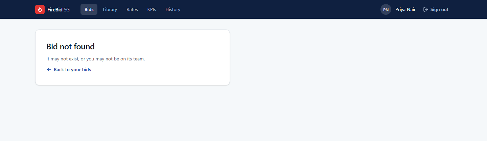

If you are on no bid at all, **Your bids** is empty and says so.

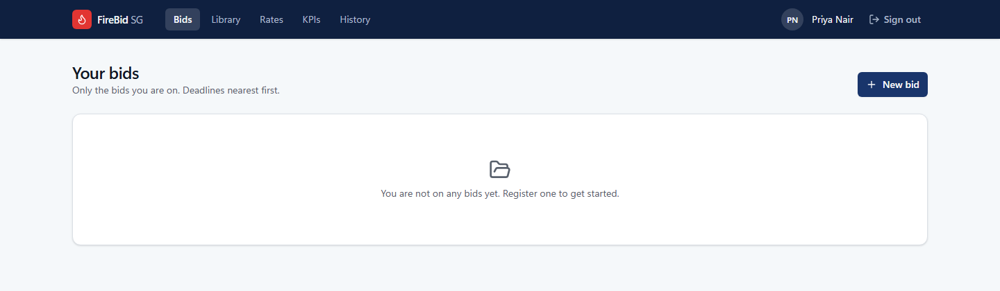

**What to do:** ask the bid manager to have you added to the bid's team.

### A required field is empty

**Register bid** does nothing while a required field is empty; the browser points at the
first one.

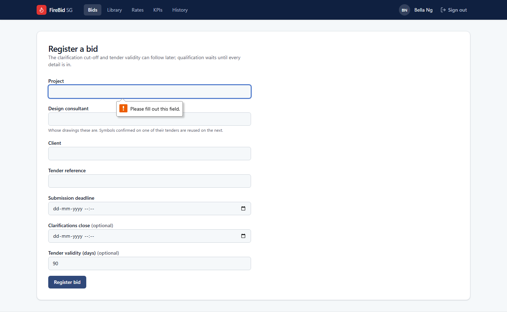

**What to do:** fill in Project, Client, Tender reference and Submission deadline. The
clarification cut-off and tender validity can wait.

### A date is missing

A bid registered without its clarification cut-off or tender validity shows a yellow
banner, and those dates read **not set**.

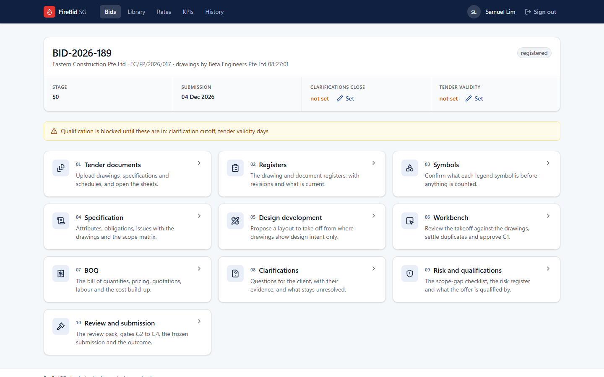

**What it stops:** qualification. Work on the documents, symbols and takeoff carries on.

**What to do:** the bid manager presses **Set** beside each date.

## Documents

### A file is refused

A file the platform cannot read is listed under **files need attention**, marked
**Refused**, with the reason. The rest of the upload is read as usual.

**What to do:** check the list after every upload. A refused drawing is a drawing that is
not in the takeoff. Send it again as PDF or DXF, or decide it is not needed.

### Other things the documents page may say

These were not staged for a screenshot.

| What you see | What it means | What to do |
| --- | --- | --- |
| **Waiting for the scanner** | Every file is scanned for malware before anything opens it; this one is held until the scanner is free | Wait. The file is held, not lost |
| **Quarantined** | The scanner found something in the file | Do not send it again. Tell your administrator |
| "larger than 200 MB: too large to send" | A file in a folder upload is over the limit; it is named, not sent | If it is an archive of the same folder, it is not needed. Otherwise split it |
| "1 sheet could not be read" with **Read again** | A sheet's linework could not be read | Press **Read again**. If it fails again, take the sheet off by hand |
| A yellow **Read again** box | Some sheets were read by an older version of the platform | Press **Read again**; nothing already read is lost |
| "This sheet has not finished being read yet" | You opened a sheet before reading finished | Come back when the counter reads Ready |
| **Manual takeoff recommended** | The sheet is a poor scan; a takeoff from it would not be reliable | Measure and count it by hand in the workbench |

### Registers

| What you see | What it means | What to do |
| --- | --- | --- |
| **To identify** | The title block could not be read with confidence | Enter the drawing number and revision in the form on that row |
| **Conflict** | Two files claim the same drawing and revision and differ | Decide which stands, on that row |
| **Superseded** | An addendum brought a newer revision | Nothing. Only the current revision is taken off |

The register can be confirmed only when every drawing and document has one current
revision; the top of the page says what stands in the way.

## Symbols

### Symbols nobody has confirmed

On a consultant's first tender every legend row reads **To confirm**, with what the
platform proposes and how it reached it ("proposed by keyword rule", "proposed by model").
Where it could not decide, the row reads **not decided**. Until rows are confirmed,
**Counted** reads "Nothing is confirmed yet" and nothing is taken off.

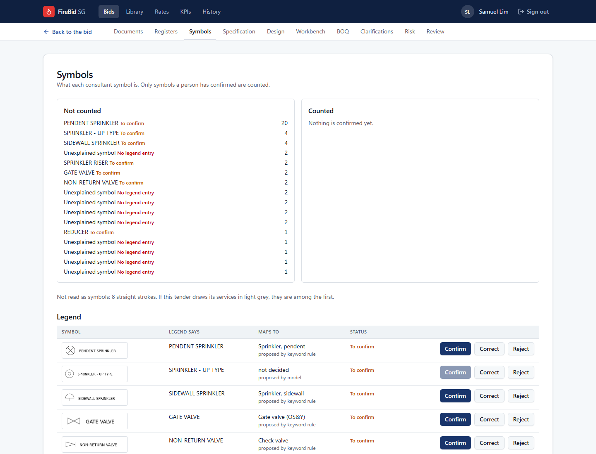

**What to do:** for each row press **Confirm** if the proposal is right, **Correct** to
pick another type, or **Reject** if the row is not an object to count.

### Symbols that are not counted

**Not counted** lists what is on the drawings and in no confirmed row: a legend row still
to confirm, or a shape no legend explains ("Unexplained symbol: No legend entry"), each
with how often it appears.

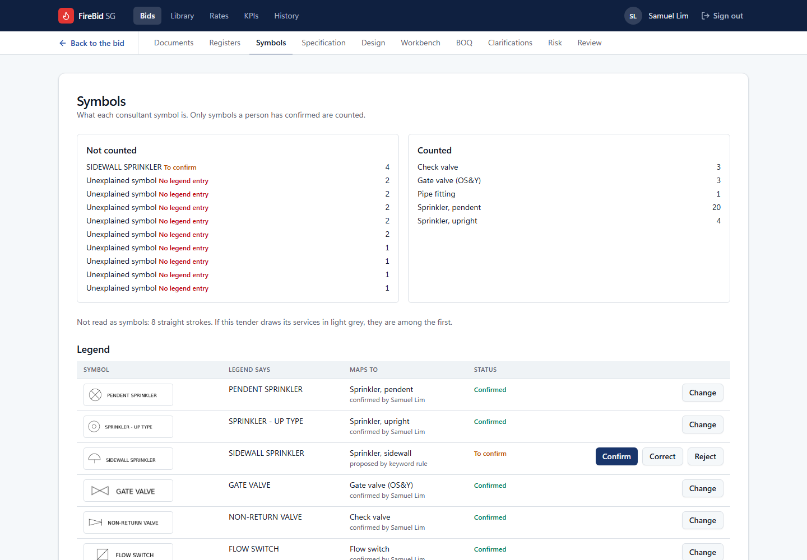

Here four sidewall sprinklers are drawn and not counted, because their legend row was left
unconfirmed.

**What to do:** confirm the row. For a shape with no legend entry, open the workbench's
**Symbols & scale** tab, choose what it is under **What is it?** and press **Name**. A
shape that is only an annotation is named "Not an installed object".

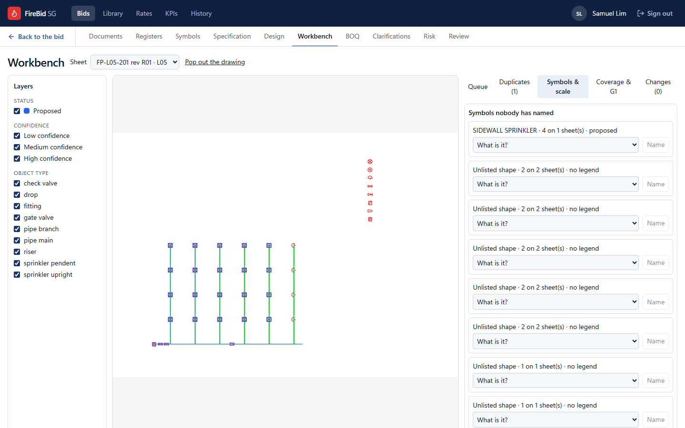

## Takeoff and G1

### The same items on two sheets

Where an enlarged plan or a schematic repeats part of a general plan, the items are found
on both. The **Duplicates** tab lists each such group.

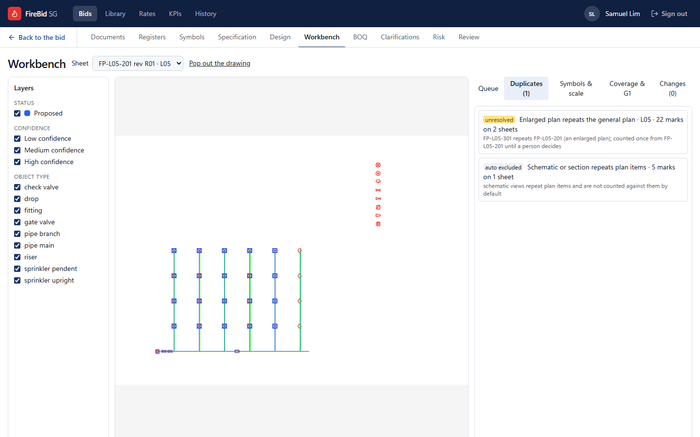

- **auto excluded:** a schematic repeating plan items. It is not counted, and needs no
  decision.
- **unresolved:** an enlarged plan repeating the general plan. The items are counted once,
  from the general plan, until a person decides.

**What to do:** open the group, check the two sheets, and say which the items are counted
from. An unresolved group blocks G1.

### G1 is blocked

**Coverage & G1** lists everything in the way, each with a link to where it is settled.
The approve button stays grey until the list is empty.

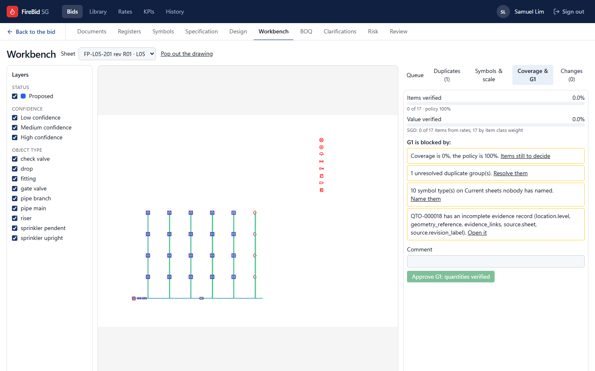

| The line says | What to do |
| --- | --- |
| "Coverage is 0%, the policy is 100%" | **Items still to decide** opens the queue. Accept or reject each item |
| "1 unresolved duplicate group(s)" | **Resolve them** opens the Duplicates tab |
| "10 symbol type(s) on Current sheets nobody has named" | **Name them** opens Symbols & scale |
| "QTO-000018 has an incomplete evidence record" | **Open it**. An item added by hand needs its level, sheet and place on the drawing |

Rejecting an item needs a reason: **Reject** stays grey until one is chosen from
**Reason…**.

### An approval is not yours to give

Each gate belongs to one role. Someone else sees the same page with the button greyed and
a line saying whose it is.

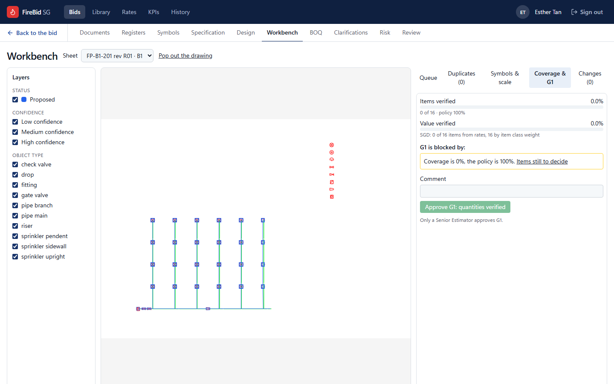

| Gate | Approved by |
| --- | --- |
| G1, G2 | Senior estimator |
| G3, G4 | Commercial director |

Some other actions are also kept to one role. **Prepare the submission** is the bid
manager's: for anyone else the count of unresolved clarifications does not change when
they press it. Importing a rate list is the senior estimator's; an estimator is offered
**Propose** instead.

## BOQ and pricing

### No BOQ is built

The BOQ page says **G2 is held up: no BOQ is built.** The client's bill can already be
read, but every line of the reconciliation reads "not measured".

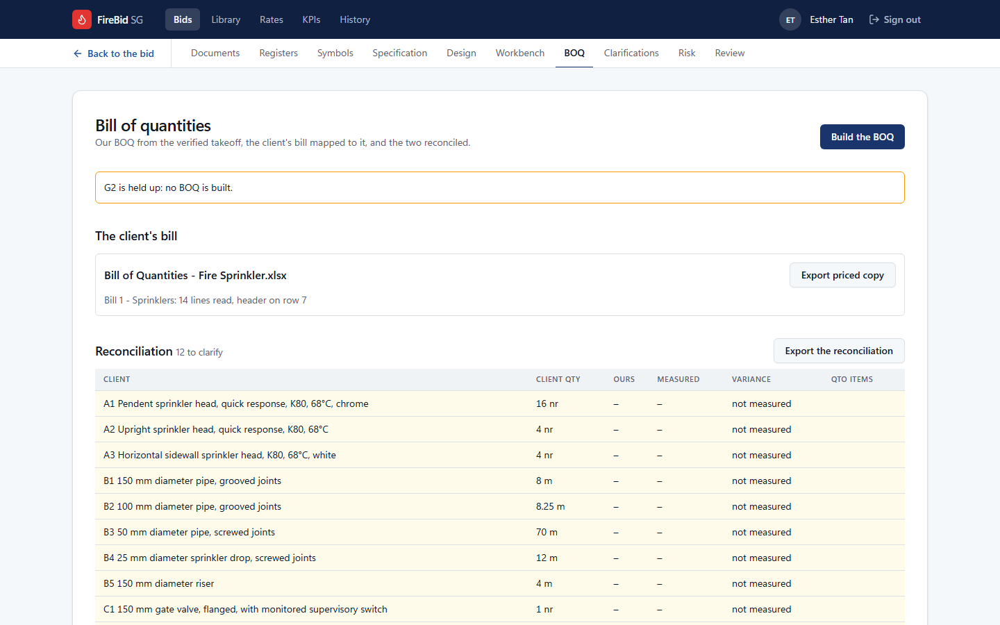

**What to do:** press **Build the BOQ**. It is built from the verified takeoff.

If the client's workbook was uploaded and the page says its columns "could not be read
with confidence", say which column is which in the form shown, and it is read again.

### A line is unpriced or its rate has expired

BOQ lines are priced only from the rate library. A line with no matching rate reads
**unpriced**, and the heading and the total both count them ("6 unpriced line(s) not
included").

A priced line may carry a warning under its description:

| Warning | What it means |
| --- | --- |
| "the rate expired on 30 Jun 2026" | The rate's validity ended before the pricing date |
| "the rate is valid until 31 Oct 2026, before the tender validity ends on 18 Feb 2027" | The price may not hold for as long as the offer does |

**What to do:**

- For an unpriced line, pick a rate with **Choose…**, or have a rate proposed to the
  library on the **Rates** page.
- For an expired or short rate, get a current quotation and have the library updated.
- A line that is deliberately not priced (hangers deemed included in pipe rates, for
  example) stays unpriced. The review pack counts it, so an approver sees it.

Nothing is priced at zero and nothing is priced without a source.

### A rate list is not imported

A rate list is imported whole or not at all. If any row has a problem the page says
**Nothing was imported. Fix these and import again**, and lists each problem by row and
column.

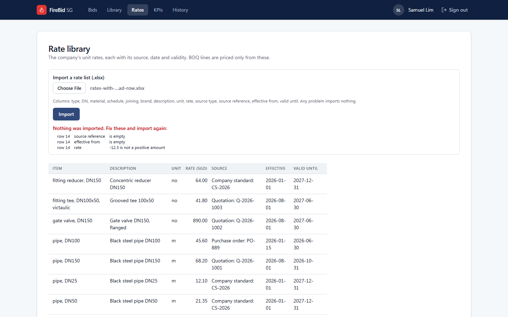

**What to do:** fix the rows named in the workbook and import it again.

An estimator does not see the import. They see the library and **Propose**, which suggests
one rate with its source and reason; the library changes only when the senior estimator
approves the proposal.

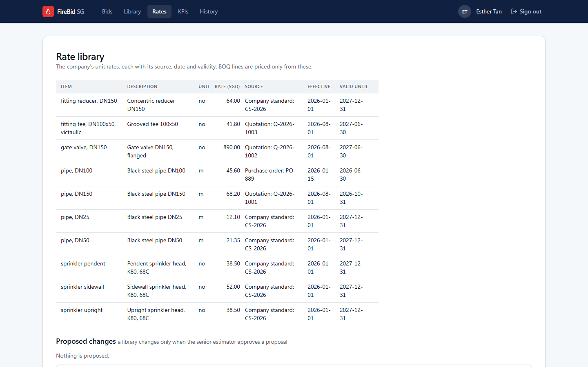

### What the reconciliation flags

A difference between the client's bill and ours is not an error to fix on the page. It is
something to ask the client.

| The row reads | What it means |
| --- | --- |
| A highlighted row with a variance (−10.0%) | Our measured quantity differs from the client's beyond tolerance |
| "not measured" | The client bills something that is on no drawing |
| "not billed" | We measured something the client's bill does not have |

Each appears under **To raise** on the clarifications page.

## Risk, review and the later gates

### Not ready for G3

Until the checklist is built, the risk page says **Not ready for G3: the scope-gap
checklist is not built.**

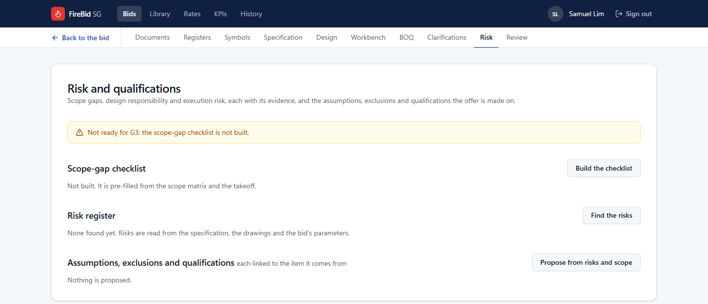

Once it is built, the banner counts what is undecided ("9 scope checklist item(s) not
resolved; 8 risk(s) with no treatment").

**What to do:** resolve each checklist item marked **to resolve** and give each risk a
treatment. The banner turns green when none is left.

### A gate is blocked

The review page shows each gate as **approved**, **ready** or **blocked**, with every
reason on its card.

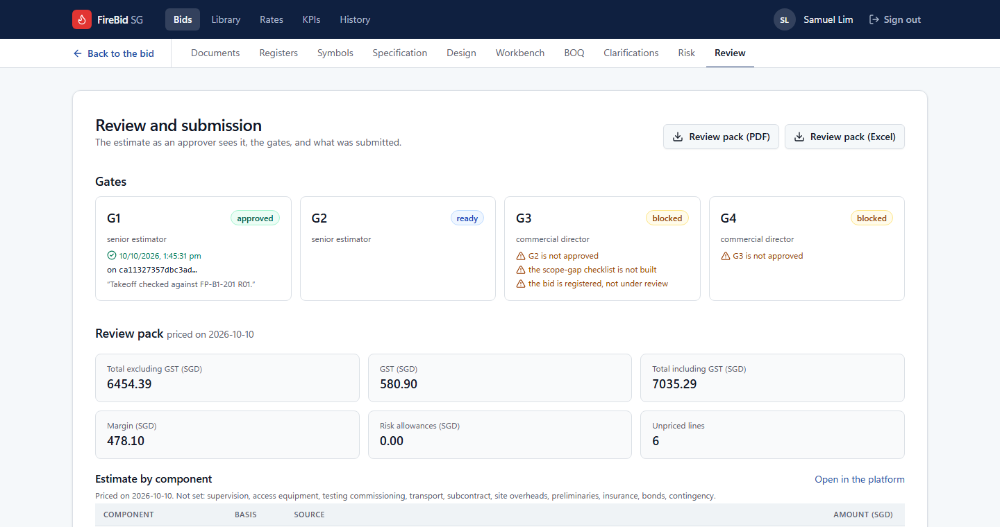

| The card says | What to do |
| --- | --- |
| "no BOQ is built" | Build the BOQ |
| "G2 is not approved", "G3 is not approved" | The gates are approved in order; the earlier one comes first |
| "the scope-gap checklist is not built" | Build it on the risk page |
| "the bid is registered, not under review" | The bid has to be moved to under review; ask your administrator |
| "1 clarification(s) unresolved: prepare the submission, so each becomes a qualification" | The bid manager presses **Prepare the submission** on the clarifications page |
| "9 qualification(s) neither accepted nor rejected" | Accept or reject each on the risk page |

G4 may be blocked after G3 is approved. The button is shown and stays grey until the list
is empty.

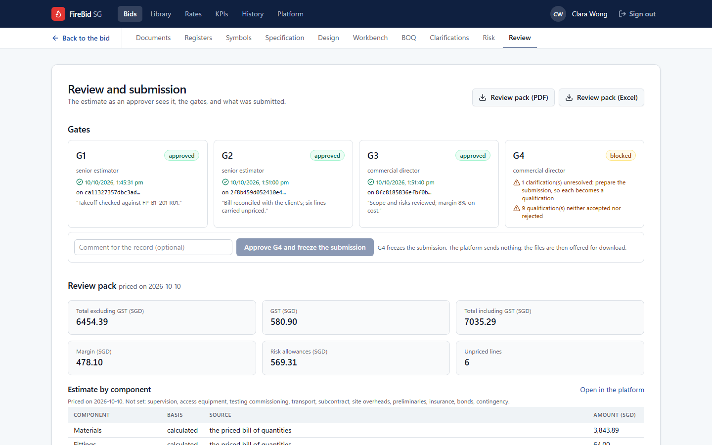

### After G4

Approving G4 freezes the submission. **Frozen submission** says whether the snapshot still
verifies: "the manifest and every file are as they were frozen". If it ever says
otherwise, do not send the files; tell your administrator.

## If the page itself fails

| What you see | What to do |
| --- | --- |
| You are sent to the sign-in page | You are signed out. Sign in again |
| A page says its data could not be loaded | Reload the page. If it persists, tell your administrator |
| A message starting "Could not…" | The action was refused, and the message says why |
