# A tender from upload to award

This walkthrough follows one bid from the day it is registered to the day its outcome is
recorded, with nothing going wrong on the way. It shows who does each step, what they
press, and what the screen looks like when the step has worked.

For what each screen offers in full, see [the screen reference](README.md). For what to do
when a step does not go this way, see [when something is not right](exceptions.md).

The screenshots were taken on 2026-10-10 from a synthetic tender on the local stack: a
basement car park sprinkler plan, its specification and the client's bill of quantities.

## The people and the bid

| Person | Role | What they do in this walkthrough |
| --- | --- | --- |
| Bella Ng | Bid manager | Registers the bid, sets its dates, prepares the submission, records the outcome |
| Esther Tan | Estimator | Uploads the tender, checks the symbols and the specification, builds the BOQ |
| Samuel Lim | Senior estimator | Verifies the takeoff, approves G1 and G2, enters the margin, treats the risks |
| Clara Wong | Commercial director | Approves G3 and G4 |

The bid is **BID-2026-188**, Marina Bay Commercial Development, for Harbourfront Builders
Pte Ltd, tender reference HB/FP/2026/041, with drawings by Alpha Consultants Pte Ltd.

## The steps at a glance

| # | Step | Who | Ends when |
| --- | --- | --- | --- |
| 1 | Sign in | Everyone | **Your bids** opens |
| 2 | Register the bid | Bid manager | The bid has a number |
| 3 | Upload the tender | Estimator | Every file is Ready |
| 4 | Check the registers | Estimator | The register reads **Register confirmed** |
| 5 | Confirm the symbols | Estimator | **Not counted** reads "Every symbol on the drawings is mapped" |
| 6 | Read the specification | Estimator | Issues are found and the scope matrix is filled |
| 7 | Verify the takeoff and approve G1 | Senior estimator | G1 is approved |
| 8 | Build, map and price the BOQ | Estimator | The bill is priced and reconciled with the client's |
| 9 | Labour and the cost build-up | Senior estimator | The margin is entered and the total stands |
| 10 | Clarifications | Estimator | The questions are drafted |
| 11 | Risk and qualifications | Senior estimator | The page reads **Ready for G3** |
| 12 | Approve G2 and G3 | Senior estimator, then commercial director | G3 is approved |
| 13 | Prepare the submission and approve G4 | Bid manager, then commercial director | The submission is frozen |
| 14 | Record the outcome | Bid manager | The bid reads **awarded** |

## 1. Sign in

Everyone signs in the same way.

1. Open FireBid SG and press **Sign in**.
2. Enter your work account on your organisation's sign-in page.
3. **Your bids** opens.

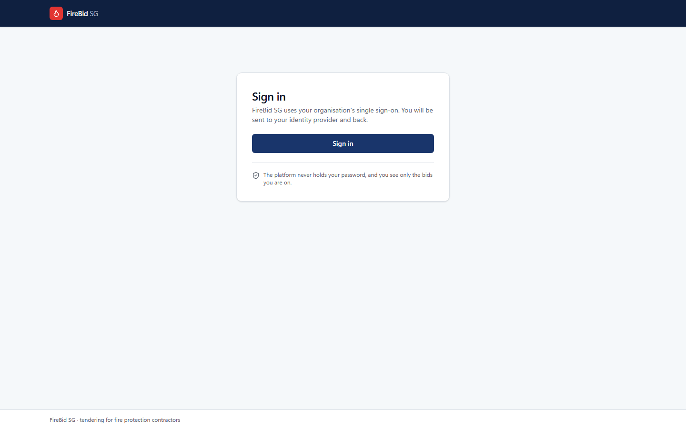

## 2. Register the bid (bid manager)

1. On **Your bids**, press **New bid**.
2. Fill in **Project**, **Design consultant**, **Client**, **Tender reference** and
   **Submission deadline**.
3. Press **Register bid**.

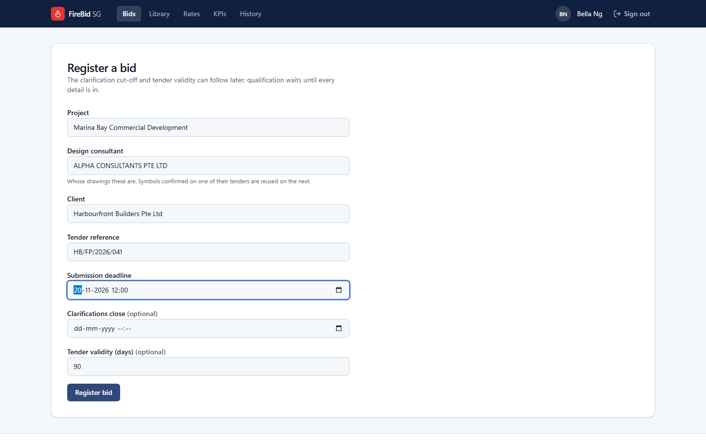

The bid opens with its number. The ten cards are the steps of the bid, in order.

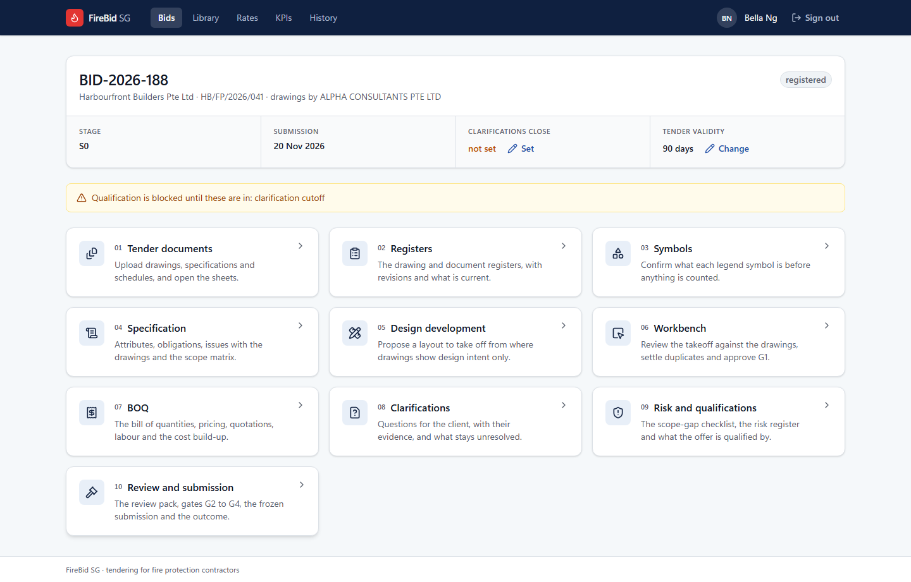

The yellow banner says the clarification cut-off is not set yet. It does not stop work on
the tender. Bella sets it later with **Set** beside **Clarifications close**; the banner
then goes.

The other people are put on the bid's team by an administrator: there is no screen for
that in this version (see [what has no screen yet](#what-has-no-screen-yet)).

## 3. Upload the tender (estimator)

1. Open the bid and click **01 Tender documents**.
2. Press **Choose Files** and pick every file of the tender set: here the drawing, the
   specification and the client's bill.
3. Leave the dropdown on **The original tender set** and press **Upload**.

The counters show the files moving from **Queued** to **Ready** while the set is read.

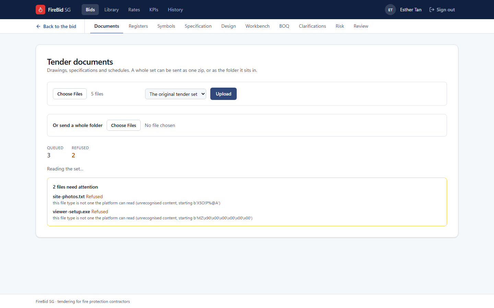

When reading has finished, every file that could be read is counted under **Ready** and
each drawing sheet appears under **Sheets**. Click a sheet to open it in the viewer.

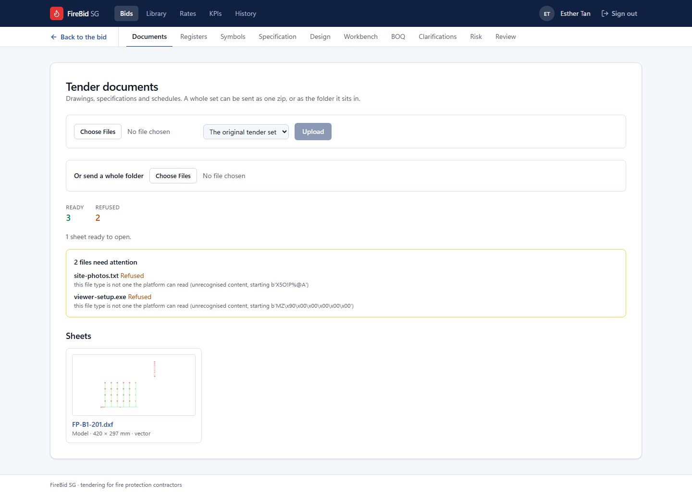

This upload also held two files the platform cannot read. They are listed under **files
need attention** with the reason, and the rest of the set is unaffected. See
[a file is refused](exceptions.md#a-file-is-refused).

## 4. Check the registers (estimator)

1. Click **Registers** in the tab bar.
2. Check each drawing's number, title, revision, date and level against the title block.

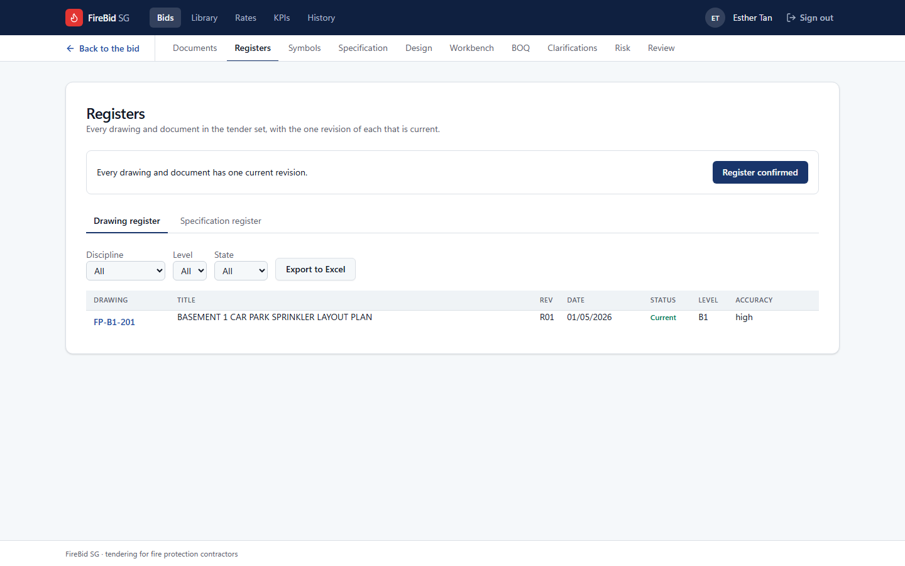

Here the one drawing, FP-B1-201 revision R01, is **Current** on level B1, and the top of
the page reads **Every drawing and document has one current revision** and **Register
confirmed**. Only current sheets are taken off.

## 5. Confirm the symbols (estimator)

1. Click **Symbols**.
2. Check every row of the **Legend** table: the symbol as drawn, what the legend says, and
   what it maps to.

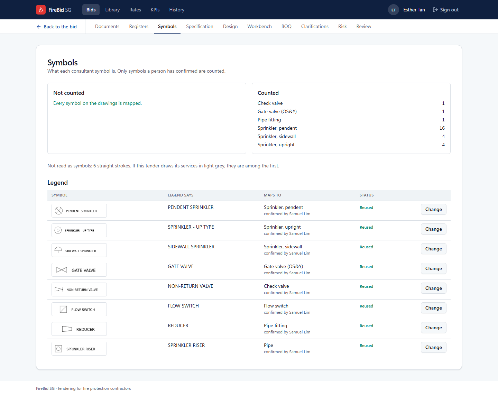

Alpha Consultants' legend has been confirmed on an earlier tender, so each row reads
**Reused**: nothing needs confirming again. The **Counted** box totals each type across the
drawings (16 pendent, 4 sidewall and 4 upright sprinklers, a gate valve, a check valve and
a reducer), and **Not counted** reads "Every symbol on the drawings is mapped".

On a consultant's first tender the rows read **To confirm** instead. See
[symbols nobody has confirmed](exceptions.md#symbols-nobody-has-confirmed).

## 6. Read the specification (estimator)

1. Click **Specification**. **Obligations** lists what the specification obliges, each
   with its clause. Each is a proposal until someone presses **Confirm**.

2. Press **Check against the drawings**, then open **Issues**. Each issue cites both
   sides: the clause, and the sheet with the words on it.

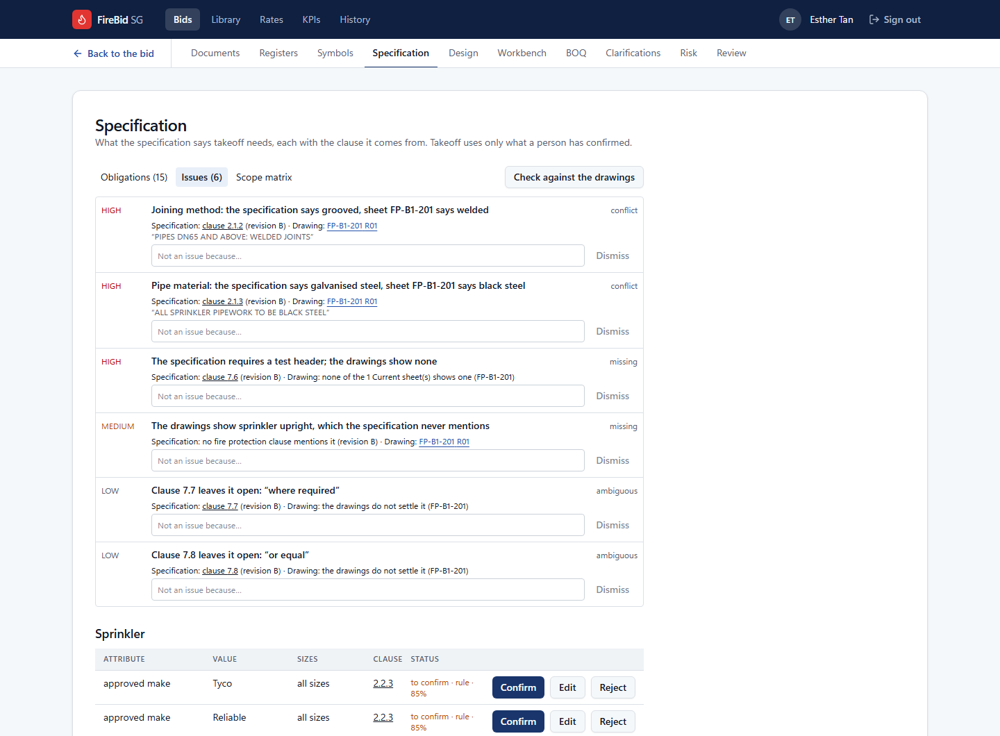

Here six issues are found. Two are conflicts: the specification says grooved joints and
galvanised pipe in the basement, the drawing's notes say welded joints and black steel.
These are not errors in the platform; they are questions for the client, and they reappear
on the clarifications page in step 10.

3. Open **Scope matrix**. Each row says whether an item is included, excluded, by others
   or unclear, with the clause it rests on. Change a row with its dropdown.

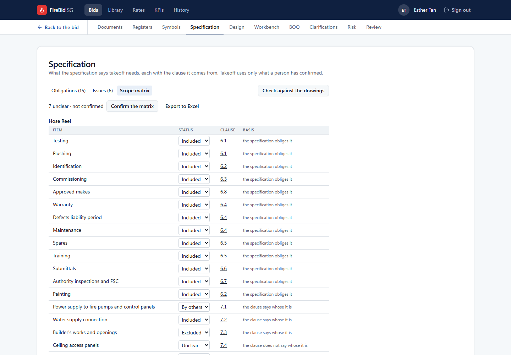

## 7. Verify the takeoff and approve G1 (senior estimator)

1. Click **Workbench**. The drawing is in the middle with every taken-off item marked on
   it; the **Queue** on the right lists the items, highest risk first.

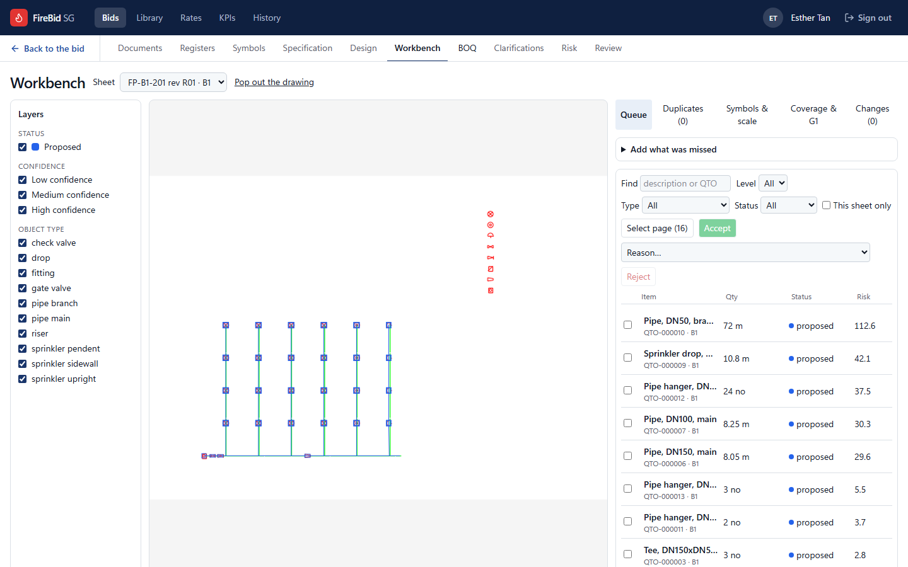

2. Click an item to see it on the drawing. Tick the items that are right, or press
   **Select page** to tick them all.

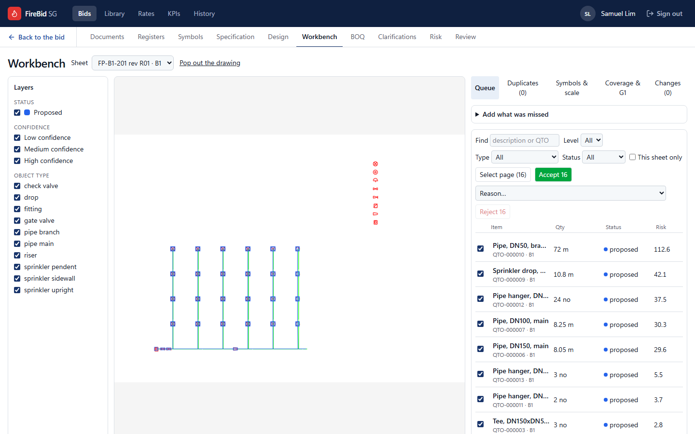

3. Press **Accept**. The marks turn green and each item reads **verified**.
4. Open **Coverage & G1**. When items verified meets the policy and nothing is listed
   under "G1 is blocked by", the approve button is live.
5. Type a **Comment** and press **Approve G1: quantities verified**.

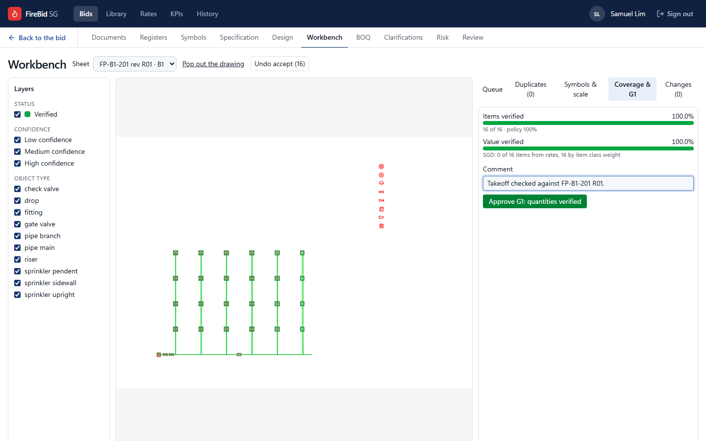

The tab then records when G1 was approved.

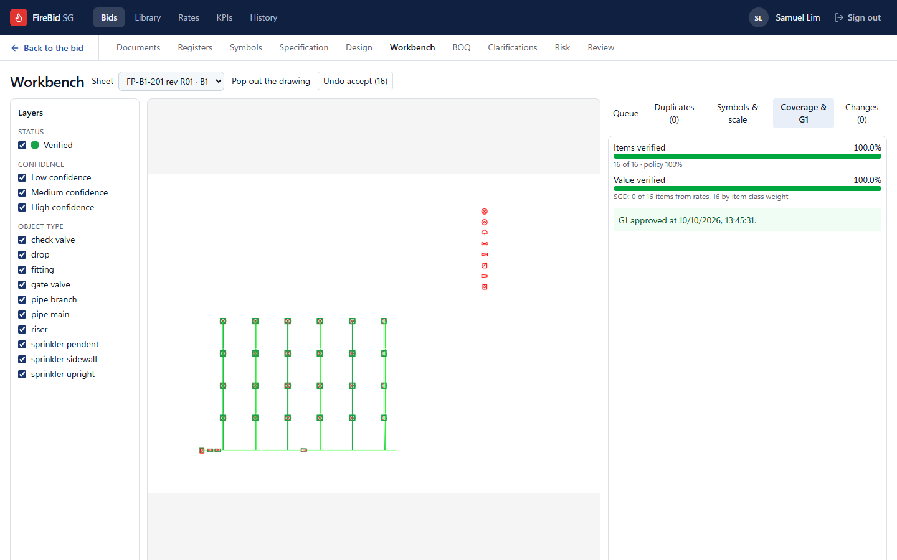

An estimator can accept items but cannot approve G1: see
[an approval is not yours to give](exceptions.md#an-approval-is-not-yours-to-give).

## 8. Build, map and price the BOQ (estimator)

1. Click **BOQ** and press **Build the BOQ**. Our bill is built from the verified takeoff:
   16 lines here, each naming the takeoff item it comes from.

2. The client's bill was uploaded with the tender and read: 14 lines. Press **Propose
   mappings**. Each client line is matched to one of ours, with the reason for the match.
3. Check each proposal and press **Confirm**, or pick another of our lines from the
   dropdown first.

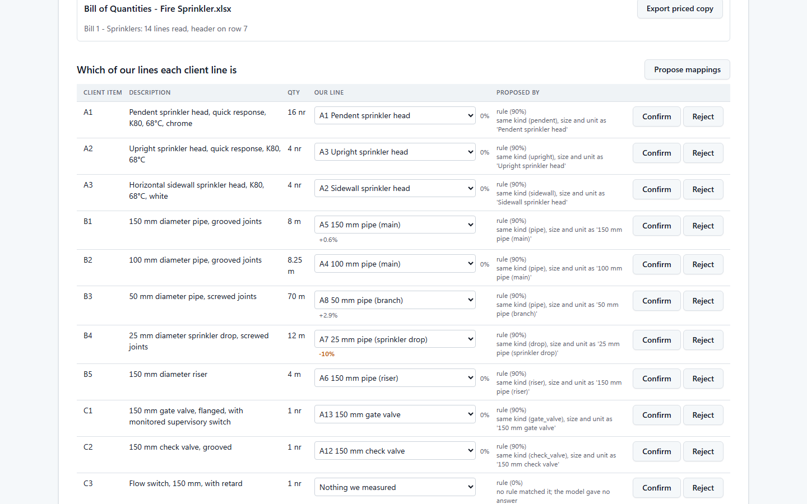

4. Read the **Reconciliation**. It sets the client's quantity beside ours for every line.

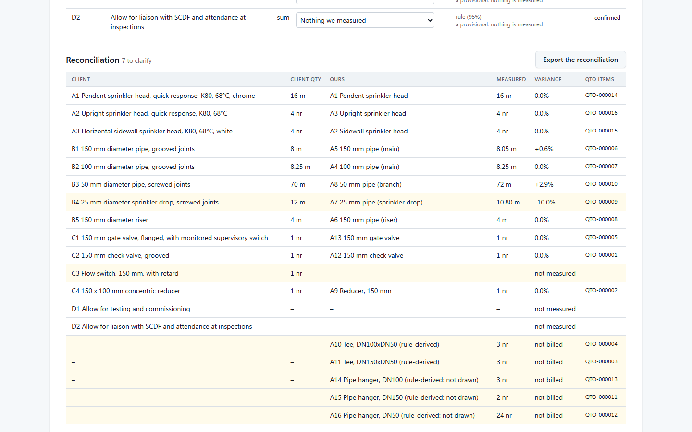

Here most lines agree. Three kinds of difference are marked for clarifying, which is the
normal result of a real tender:

- a quantity that differs beyond tolerance (the client bills 12 m of sprinkler drop, we
  measure 10.80 m);
- a client line with nothing measured (a flow switch that is on no drawing);
- lines of ours the client's bill does not have (tees and hangers derived by rule).

5. Under **Pricing**, press **Price from the rate library**. Each line shows its rate, its
   amount and the source of the rate.

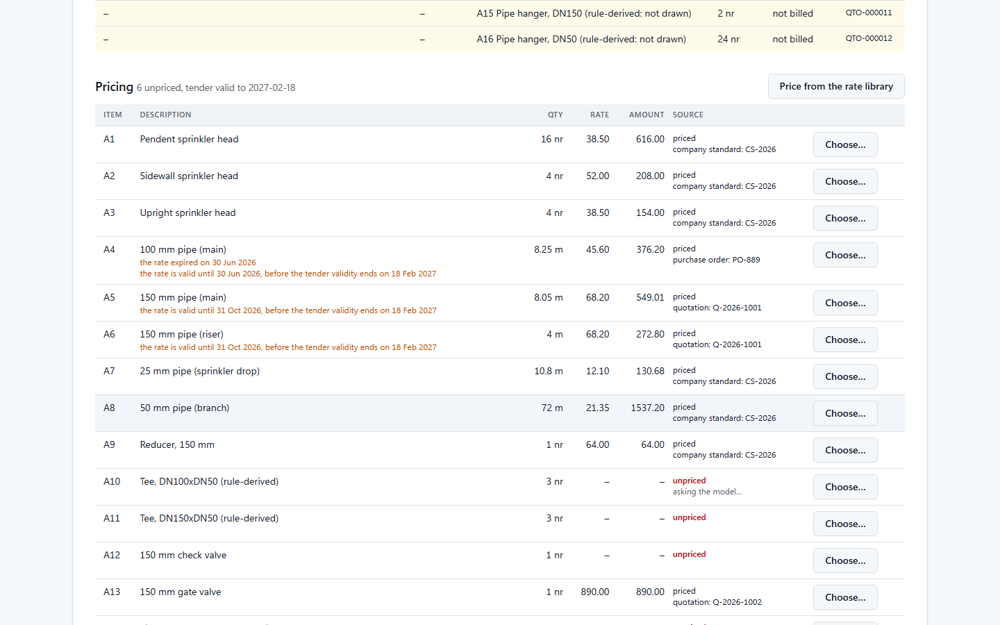

Lines with no rate in the library stay **unpriced** and are left out of the total, which
says so. A line whose rate has expired, or ends before the tender's validity does, carries
a warning under its description. See
[a line is unpriced or its rate has expired](exceptions.md#a-line-is-unpriced-or-its-rate-has-expired).

## 9. Labour and the cost build-up (senior estimator)

**Labour** works out man-hours for each line from the company's productivity library, and
the cost from the labour rate table. Each line shows its baseline hours, where the
productivity figure came from, any multipliers, and the trade's hourly rate.

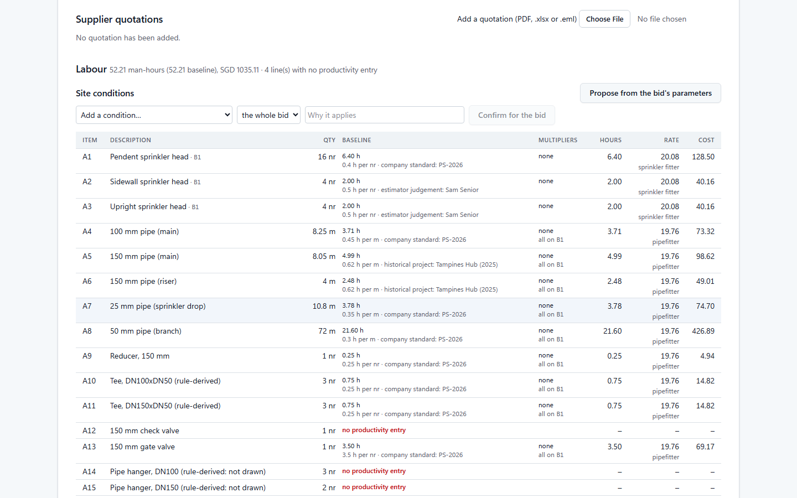

A line with no entry in the productivity library reads "no productivity entry" and adds no
hours. Site conditions (height, basement, night work and so on) are proposed with
**Propose from the bid's parameters**, and count only once someone confirms them.

**Cost build-up** adds every component of the estimate. Materials, fittings, valves,
equipment, wastage and labour are calculated; the rest are entered by a person.

1. Press **Enter…** on the **Margin** row.
2. Choose **% of**, the base (**cost** here) and the figure, then press **Save**.

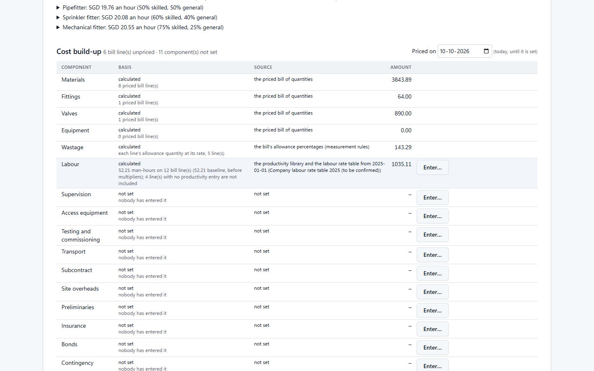

The row then shows who entered it and when, and the totals follow: SGD 6,454.39 excluding
GST and 7,035.29 including it.

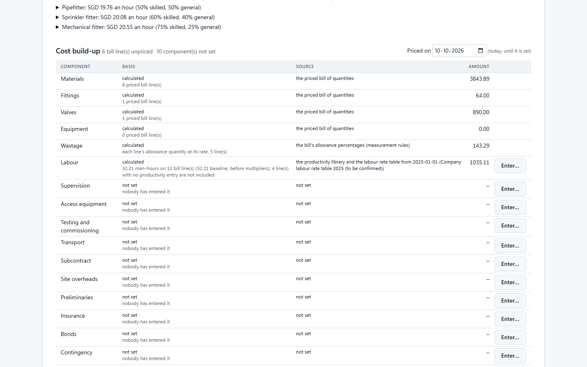

A component nobody has entered reads **not set** and adds nothing. The review pack lists
every component that is not set, so an approver sees what the total leaves out.

## 10. Clarifications (estimator)

1. Click **Clarifications**. **To raise** lists everything flagged so far that is not yet
   in a clarification: the specification issues, the bill variances and the unclear scope
   rows, grouped where they are about the same thing.
2. Press **Confirm the group and draft one** on a group, or **Draft** on a single issue.

The draft (TC-001 here) carries the question, the evidence on both sides and the date it
must be issued by. Edit the wording, then press **Send for internal review**. **Download
the register** takes the register out in the chosen template, as Excel or Word.

## 11. Risk and qualifications (senior estimator)

1. Click **Risk** and press **Build the checklist**, **Find the risks** and **Propose from
   risks and scope**, in that order.

The yellow banner counts what is undecided: here nine checklist items and eight risks.

2. For each checklist item marked **to resolve**, pick **Resolve as…** (included, excluded,
   by others or clarified), say why, and press **Save**.
3. For each risk, pick a treatment (price, qualify, clarify or accept), set it to
   **treated** and press **Save**.

When nothing is left the banner turns green: **Ready for G3: every checklist item is
resolved and every risk has a treatment.**

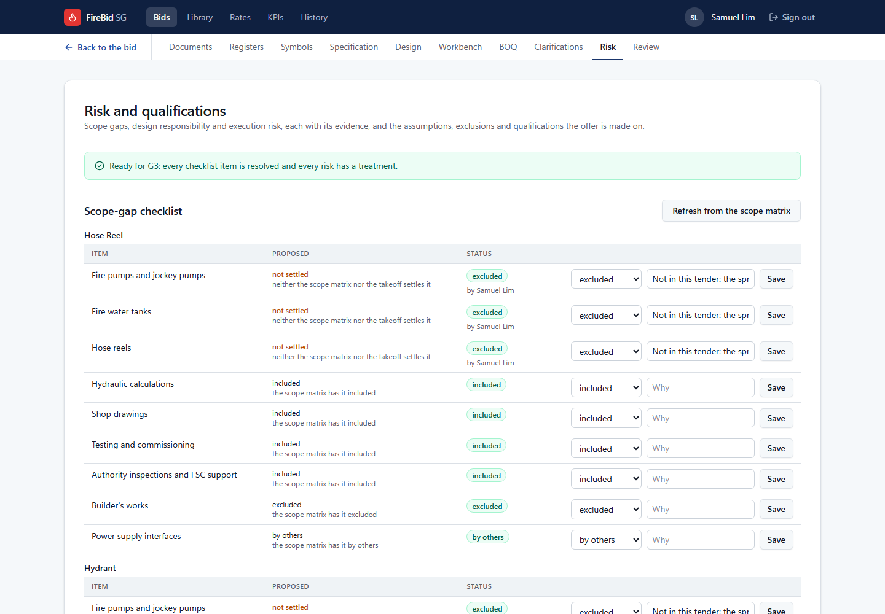

4. Under **Assumptions, exclusions and qualifications**, read each proposed wording, edit
   it if needed, and press **Accept** or **Reject**. Each is linked to the scope row, risk
   or clarification it comes from.

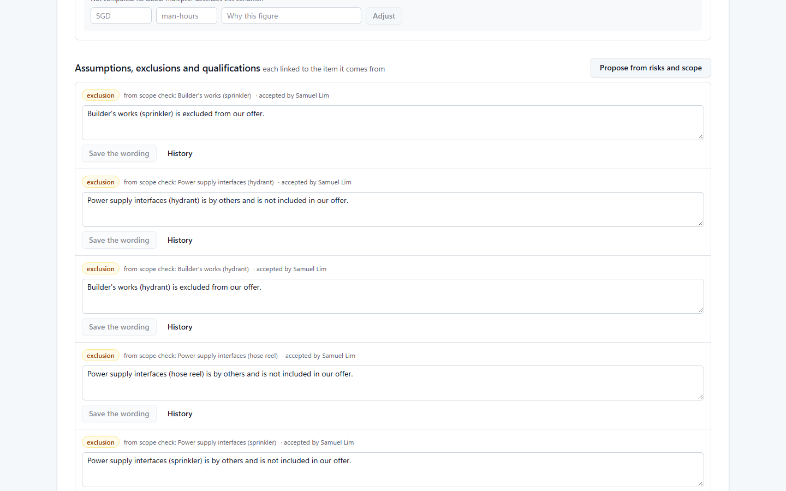

## 12. Approve G2 and G3

**G2** is the senior estimator's approval of the bill. The BOQ page says what holds it up;
once it reads "Nothing in the BOQ holds up G2" it can be approved. In this version G2 is
recorded by an administrator on the senior estimator's behalf
(see [what has no screen yet](#what-has-no-screen-yet)).

**G3** is the commercial director's. Click **Review**. Each gate's card shows whether it is
approved, ready or blocked, and what blocks it.

1. Read the **Review pack** below the gates: the totals, the estimate by component and by
   system, the variances, the open clarifications and the unpriced lines.
2. Type a comment for the record and press **Approve G3**.

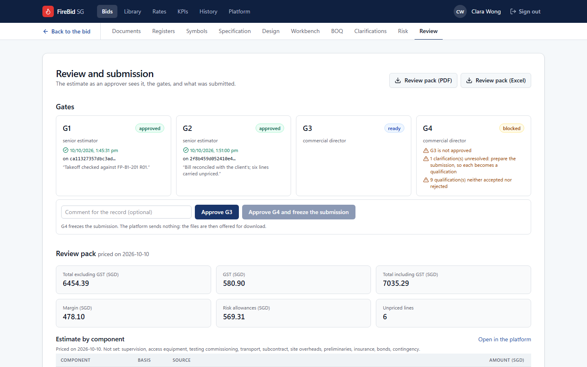

## 13. Prepare the submission and approve G4

G4 is blocked while a clarification is unresolved or a qualification is undecided. The
bid manager clears both.

1. As bid manager, click **Clarifications**. The **Register** lists each clarification and
   its state.
2. Press **Prepare the submission**. Each clarification still unresolved becomes a
   proposed qualification, linked back to it.
3. Accept or reject each proposed qualification.

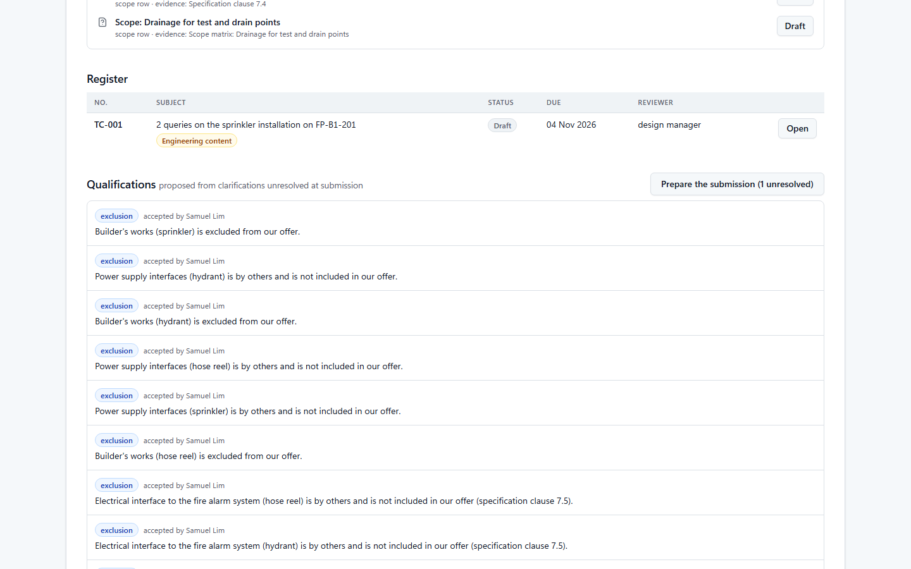

4. As commercial director, click **Review**. G4 now reads **ready**.
5. Type a comment and press **Approve G4 and freeze the submission**.

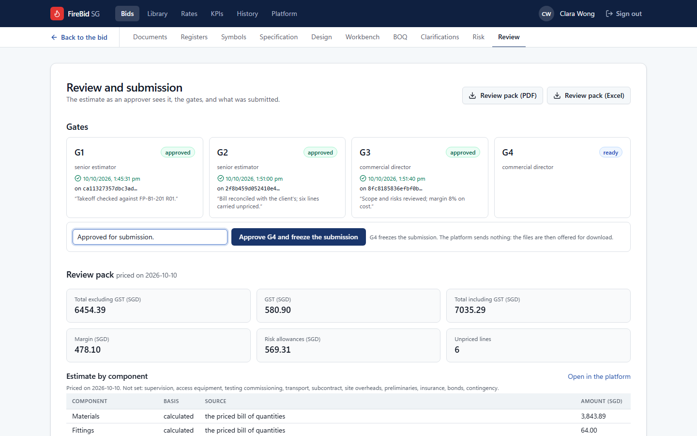

G4 freezes the submission. **Frozen submission** lists the files exactly as they were
approved (the bill, the review pack, the qualifications and the clarifications), each with
a **Download** button, and says whether the snapshot still verifies.

FireBid SG sends nothing to the client. You download the files and send them yourself.

## 14. Record the outcome (bid manager)

1. On **Review**, under **Outcome**, choose **Awarded**, **Lost** or **Withdrawn**.
2. Enter the awarded price, the reasons and any feedback about competitors.
3. Press **Record the outcome**.

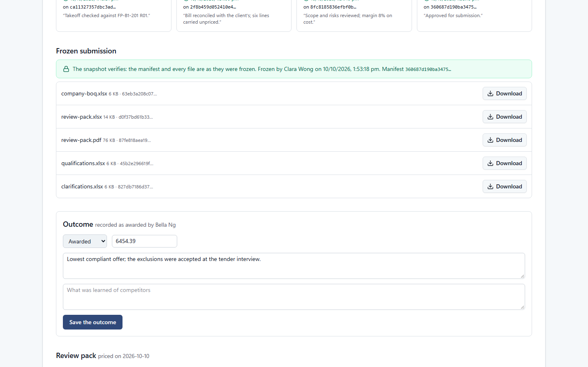

The bid page then reads **awarded**.

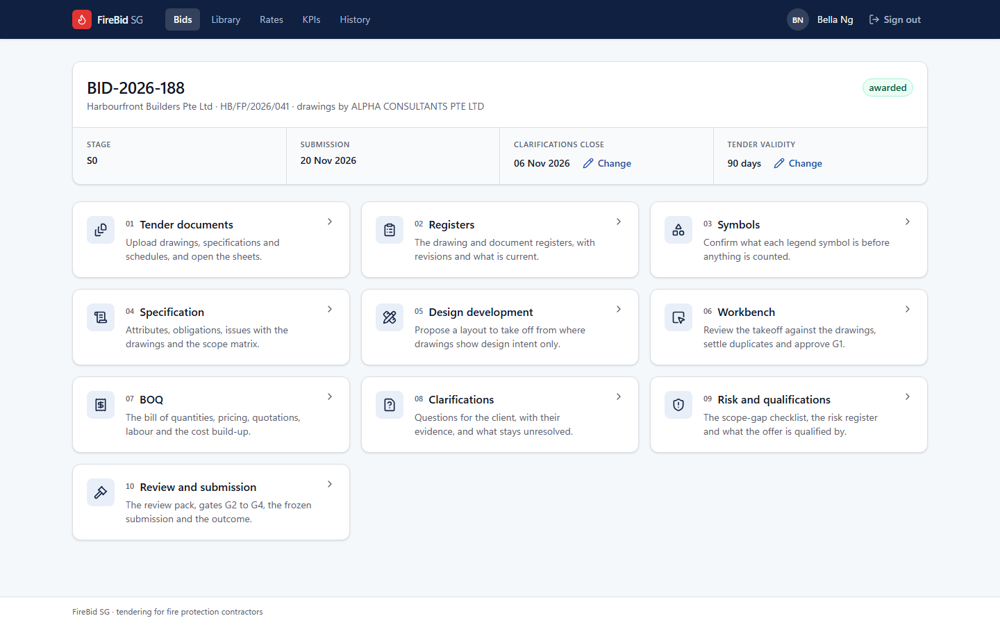

## What has no screen yet

Four things in this walkthrough are done by an administrator through the platform's API,
because this version has no screen for them:

| What | When it is needed |
| --- | --- |
| Putting people on a bid's team | After the bid is registered (step 2) |
| Importing the productivity list | Before labour can be worked out (step 9) |
| Approving G2 | After the BOQ is built and reconciled (step 12) |
| Moving the bid on: qualifying, in preparation, under review | Before G3; the gate reads "the bid is registered, not under review" until then |

Everything else in the walkthrough is done on the screens shown.
