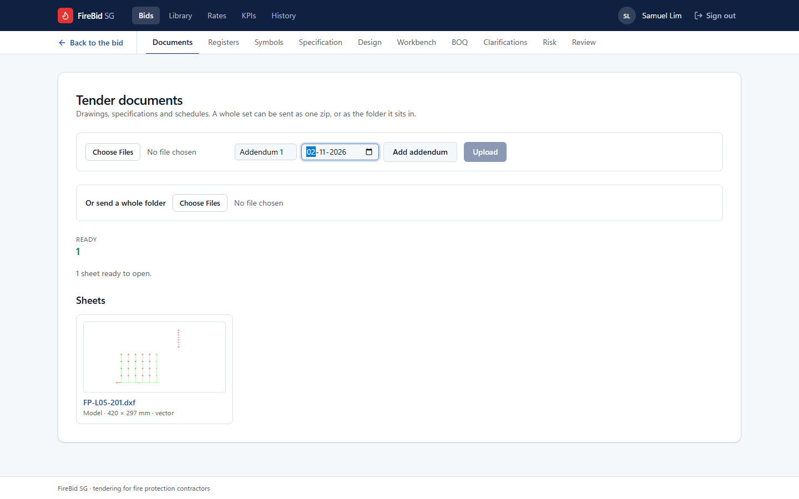
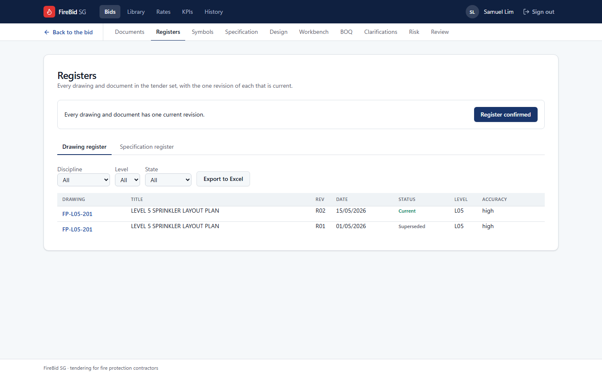
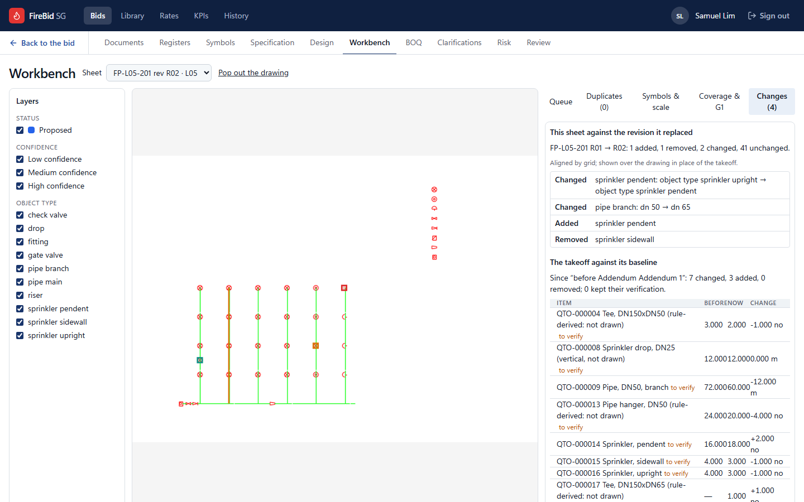
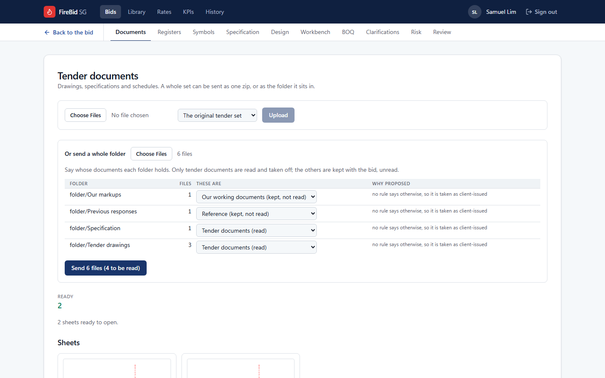
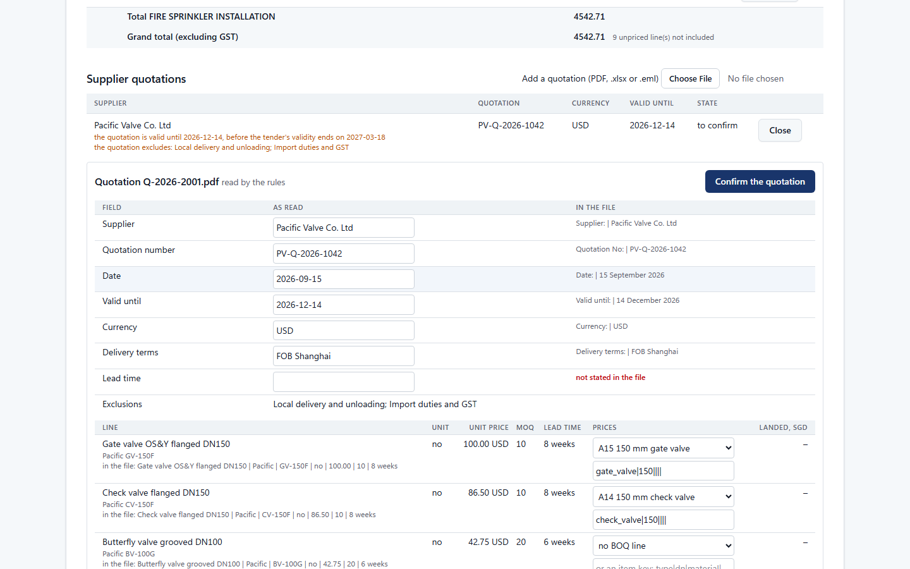
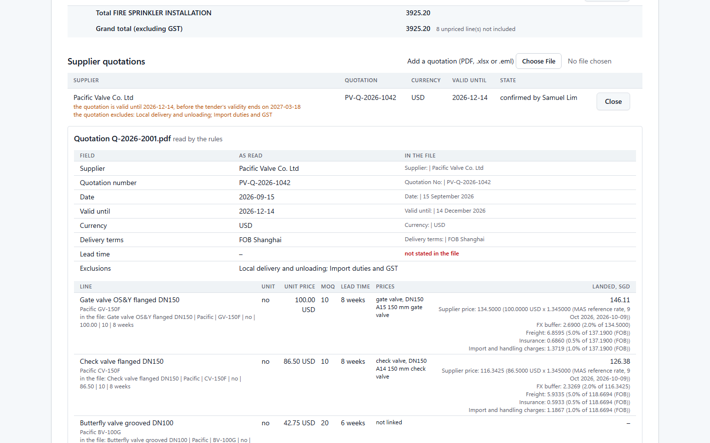
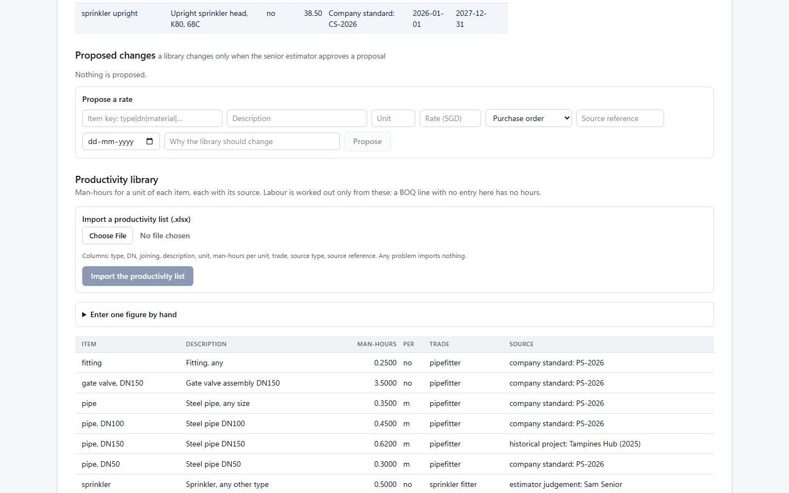
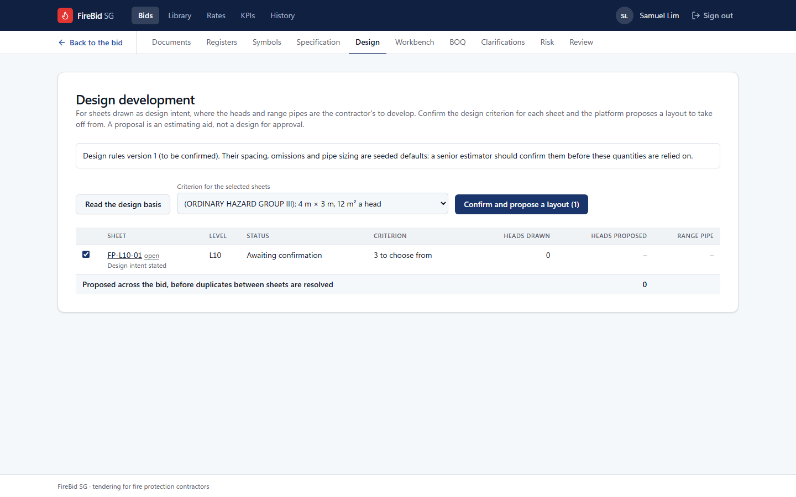
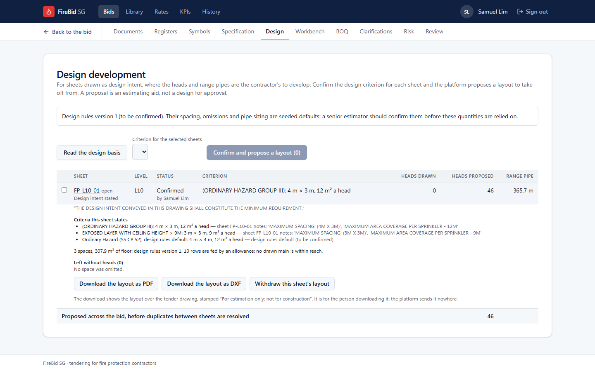

# Steps some tenders need

[A tender from upload to award](happy-path.md) follows a bid where the documents arrive
once, in one currency, fully drawn. Many tenders are not like that. This part covers four
things that happen often enough to need their own steps:

| When | Go to |
| --- | --- |
| The client issues an addendum with revised drawings | [An addendum arrives](#an-addendum-arrives) |
| The tender set is kept in folders, mixed with your own files | [A tender kept in folders](#a-tender-kept-in-folders) |
| A supplier quotes for items on the bill | [A supplier's quotation](#a-suppliers-quotation) |
| The drawings show the mains and leave the heads to you | [Drawings that show design intent only](#drawings-that-show-design-intent-only) |

The screenshots were taken on 2026-10-11 from synthetic bids on the local stack.

## An addendum arrives

An addendum's drawings replace the ones they revise. FireBid SG keeps both, takes off only
the current one, and shows exactly what changed.

1. Open **Tender documents**. In the dropdown beside **Choose Files**, pick **A new
   addendum…**.
2. Enter the **Addendum number** and the **Addendum date**, and press **Add addendum**.
   The date matters: it orders what replaces what.

3. The dropdown now reads the addendum's name. Choose the addendum's files and press
   **Upload**.
4. When the files are read, open **Registers**. Each revised drawing has two rows: the new
   revision is **Current** and the one it replaces is **Superseded**.

5. Open the **Workbench** and its **Changes** tab. The top half compares the sheet with the
   revision it replaced: what was added, removed and changed, drawn over the sheet. The
   lower half compares the takeoff with what it was before the addendum, item by item.

Here the addendum added a pendent head, removed a sidewall head, turned one upright head
into a pendent, and resized one branch from DN50 to DN65. The takeoff follows: 12 m less
of DN50, 12 m of DN65, and the tees and hangers that go with them.

**What you have to do again.** The tab says how many items kept their verification. The
others are checked again in the queue, and G1 is approved on the new quantities. If the
BOQ was already built, press **Build again from the takeoff**.

## A tender kept in folders

A real tender folder holds more than the client's documents: your own marked-up copies,
earlier responses, registers. Only the client's documents may be read. A marked-up copy
carries the client's drawing number, and read as a tender drawing it could replace the
client's own sheet.

1. On **Tender documents**, under **Or send a whole folder**, press **Choose Files** and
   pick the folder.
2. Before anything is sent, each folder is listed with what it is taken as and why. Set
   each one:

| These are | What happens to the files |
| --- | --- |
| Tender documents (read) | Read and taken off |
| Our working documents (kept, not read) | Kept with the bid; never read |
| Reference (kept, not read) | Kept with the bid; never read |
| Leave out | Not sent |

3. The button says how many files will be sent and how many of them read. Press it.

Every file is accounted for at the end. A file over 200 MB is named, not sent: if it is a
zip of the same folder, it is not needed.

## A supplier's quotation

A quotation prices the lines it is linked to, with the quotation as the source of each
price.

1. On the **BOQ** page, under **Supplier quotations**, choose the supplier's file: a PDF,
   a workbook or a saved email.
2. When it is read, the quotation is listed with what was found in it. Warnings sit under
   the supplier's name: here the quotation ends before the tender's validity does, and it
   states two exclusions. Press **Check**.
3. Check each field against the line of the file it was read from, shown beside it.
   Correct any that is wrong.
4. For each quoted line, choose **our line** it prices from the dropdown. A line with no
   counterpart on the bill is left as "no BOQ line".

5. Press **Confirm the quotation**. It then reads "confirmed by" with your name, and the
   linked lines are priced from it on the next pricing run.

### A quotation in another currency

A foreign price is brought to SGD at a recorded exchange rate, plus the buffer and import
lines the company has configured. If no rate is recorded for the currency, confirming is
refused: **"no FX rate is recorded for USD: record one before pricing"**.

The senior estimator records the rate on the **Rates** page, under **Exchange rates**:

1. Enter the **Currency** by its three-letter code, how many **SGD for one unit**, the
   date the rate is of, and where it is from.
2. Press **Record the rate**.

A rate is not taken without its source and date. A later rate for the same currency does
not replace the earlier one: both are kept.

## Drawings that show design intent only

Some tenders draw the mains and say the contractor develops the rest. A takeoff of what is
drawn then counts no heads. **Design development** proposes a layout to take off from. It
is an estimating aid, not a design for approval.

1. Upload the drawings and make sure each plan's scale is verified.
2. Open **Design** and press **Read the design basis**. Reading takes a moment; refresh
   the page. Each plan sheet is then listed with whether it states design intent and the
   criteria its notes give.
3. Tick the sheets, and pick the **Criterion for the selected sheets**. The choices are
   the criteria the sheet's own notes state, and the design rules' default.

4. Press **Confirm and propose a layout**. This is the senior estimator's or the design
   manager's to confirm: nothing is laid out before it.

The sheet then shows who confirmed it, the criterion, and what is proposed: here 46 heads
and 365.7 m of range pipe on a floor with none drawn. Click the sheet to open it.

- **Criteria this sheet states** quotes the notes each criterion was read from.
- **Left without heads** lists any space that was omitted, and why.
- **Download the layout as PDF** or **DXF** gives the layout over the tender drawing,
  stamped "For estimation only: not for construction".
- **Withdraw this sheet's layout** removes the proposal and what was taken off from it.

The design rules behind the spacing and pipe sizes are seeded defaults until a senior
estimator confirms them; the page says so at the top.
